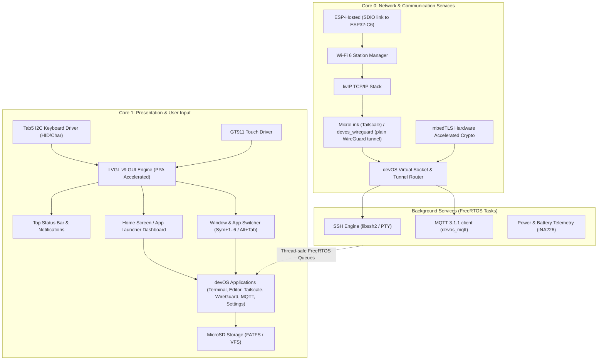

# devOS for M5Stack Tab5: Architecture & Implementation Plan

`devOS` is an open-source, developer-focused mobile operating system and firmware for the **M5Stack Tab5** equipped with the **A164 70-Key Physical Keyboard**. It transforms the Tab5 into a standalone, pocketable cyberdeck tailored for remote software engineering over SSH, secure remote systems management, and distraction-free writing.

---

```
  +-----------------------------------------------------------------------------+
  | [devOS]          [WiFi: HomeWiFi -58dBm]        [IP: 192.168.1.50]         94% |
  +-----------------------------------------------------------------------------+
  |                                                                             |
  |   14:28  Wednesday, Sep 20                                                  |
  |   Tailscale: 100.64.0.10 (if connected) | Battery: 7.8V (3.2W, ~4.8h left) |
  |   Memory: 28.4 MB Free PSRAM             | CPU: Core 0: 4% | Core 1: 18%    |
  |                                                                             |
  |  +----------------+  +----------------+  +----------------+  +------------+ |
  |  | [1] Terminal   |  | [2] Editor     |  | [3] Tailscale  |  | [4] WireGu.| |
  |  | SSH + VT100    |  | SD Card Files  |  | Mesh Net       |  | VPN tunnel | |
  |  | * 1 Session    |  | * todo.md      |  | * 6 Peers      |  | * Off      | |
  |  +----------------+  +----------------+  +----------------+  +------------+ |
  |  +----------------+  +----------------+                                     |
  |  | [5] MQTT       |  | [6] Settings   |                                     |
  |  | Broker traffic |  | System         |                                     |
  |  | * 4.2 msg/s    |  | * Wi-Fi        |                                     |
  |  +----------------+  +----------------+                                     |
  |                                                                             |
  |               ◄ [Page 1 / 1]  ●                    [⇋ Arrange]             |
  +-----------------------------------------------------------------------------+
  | [Enter/Tap] Launch | [1-8] Page Key | [PgUp/PgDn] Flip | [Sym+H] Home        |
  +-----------------------------------------------------------------------------+
```

---

## 1. System & Hardware Specifications

### 1.1 Hardware Specifications (M5Stack Tab5 + Keyboard)

| Subsystem | Component | Specifications & Interfaces |
| :--- | :--- | :--- |
| **Main SoC** | Espressif ESP32-P4 | Dual-core RISC-V @ 400 MHz, LP RISC-V @ 40 MHz, 32 MB PSRAM, 16 MB SPI Flash, Hardware 2D PPA (Pixel Processing Accelerator) |
| **Wireless Co-SoC** | Espressif ESP32-C6-MINI-1U | Wi-Fi 6 (2.4 GHz, 802.11ax), Bluetooth 5.2 (LE), Zigbee/Thread; connected to P4 via SDIO using **ESP-Hosted** |
| **Display** | 5.0" IPS TFT Panel | 1280 × 720 resolution, MIPI-DSI interface (ST7123 / EK79007 controller), 60 Hz refresh, 24-bit RGB888 |
| **Touchscreen** | Goodix GT911 | 5-point capacitive multi-touch via dedicated I2C bus |
| **Physical Keyboard** | M5Stack Tab5 Keyboard (A164) | 70-key 14×5 matrix, STM32F030C8T6 coprocessor, I2C address `0x6D` on `Ext.Port1` (SDA: GPIO 0, SCL: GPIO 1, INT: GPIO 50), dual WS2812 status RGBs |
| **Secondary Input** | USB-A 2.0 Host | Supports standard external USB HID keyboards and mice |
| **Camera** | SC2356 (2 Megapixel) | esp_cam_sensor "SC202CS": 1-lane MIPI-CSI (RAW8 1280x720 @ 30 fps), SCCB 0x36 on the internal I2C bus, 24 MHz on-board oscillator, reset on IO expander 0x43 P6 |
| **Local Storage** | MicroSD Slot | 4-bit SDMMC / SPI mode, supporting FAT32 / exFAT cards up to 2TB |
| **Power System** | NP-F550 Mount + INA226 | Removable standard NP-F550 Li-ion battery pack, INA226 I2C power/current monitor, USB-C PD charging |
| **Real-Time Clock** | Epson RX8130CE | I2C RTC with coin-cell battery backup for accurate offline timestamps |
| **Audio** | ES8388 + ES7210 | Dual-channel I2S codec, onboard dual-microphone array, 1W internal speaker, 3.5mm audio jack |
| **Sensors** | Bosch BMI270 | 6-axis IMU (accelerometer + gyroscope) for orientation and motion-wake |

---

## 2. Firmware Software Stack & Architecture

`devOS` is built on top of **ESP-IDF v5.4+** to leverage native ESP32-P4 support, MIPI-DSI hardware acceleration, and the latest lwIP/FreeRTOS enhancements.



### 2.1 Component Selection Matrix

| Subsystem | Primary Selection | License | Alternative / Fallback | Rationale |
| :--- | :--- | :--- | :--- | :--- |
| **OS / RTOS** | ESP-IDF v5.4.x | Apache-2.0 | - | Official Espressif framework with mandatory ESP32-P4 & MIPI-DSI support |
| **GUI Framework** | LVGL v9.2+ | MIT | - | Rich widget set, PPA 2D hardware blitting, monospace terminal & markdown rendering support |
| **Tailscale / VPN** | MicroLink v2 | MIT | `trombik/esp_wireguard` | Full `ts2021` Tailscale protocol stack (DERP relays, STUN, DISCO, MagicDNS, WireGuard ChaCha20-Poly1305) |
| **SSH Client** | `libssh2` (`skuodi/libssh2_esp`) | BSD-3-Clause | `david-cermak/libssh` or `wolfSSH` | Permissive BSD license, supports interactive PTY, password & Ed25519/RSA key auth, proven on ESP32 |
| **HTTP Client** | `devos_http` (HTTP/1.1 + mbedTLS over the devos_net sockets): OTA, REST, Docker, ADS-B, maps | MIT (ours) | `esp_http_client` | Goes through the socket layer, so VPN routing applies; one client for every app |
| **JSON Parser** | Minimal shared reader in `devos_json` (strings, arrays, key lookup), used by `devos_ota` | MIT | `cJSON` / `yyjson` | Only the consumed shapes are parsed; zero new dependencies |
| **Markdown Parser** | Shared CommonMark-subset renderer in `devos_mdview` (LVGL spangroup-based), used by the editor preview | MIT | `md4c` | No extra dependency for the covered subset; host-side unit test in `tools/md_preview_test.c` |
| **Terminal ANSI Engine** | Custom VT100/ANSI parser + LVGL canvas | MIT | Ported `libvterm` | Lightweight, customized for 1280x720 character grid (160x45 columns/rows) |

---

## 3. Core Feature Architecture & Modules

> [!NOTE]
> **Removed on 2026-09-26:** the OpenCode / OpenChamber client (`app_opendev`), the Antigravity
> client (`app_antigravity` and its `tools/agy_bridge` host daemon), the shared tri-pane agent
> viewport with Focus Mode, and camera QR pairing. They were too heavy for the Tab5 and kept
> crashing it; the Terminal app (SSH) covers remote work instead. Their sections (3.2, 3.5, 3.6),
> roadmap Phase 5 and the Antigravity items of Phase 6 are gone; section numbers were kept.

### 3.0 Home Screen & Desktop Environment (`app_launcher`)

The Home Screen serves as the operational dashboard and application launcher for `devOS`.

*   **Visual Layout & Scalable Grid (1280×720):**
    *   **Top Bar (Persistent across all apps):** Displays devOS logo/home trigger, current Wi-Fi SSID with signal strength (dBm), **Local Network IP (`IP: 10.x.y.z` or `192.168.x.y`, always shown whether Tailscale is connected or not) alongside an authentic Tailscale 3×3 dot matrix icon displayed next to the IP if Tailscale is connected**, battery percentage, and RTC clock. (Theme control lives in Settings + `Sym + T`; the top bar carries no theme button.) Tapping the Wi-Fi label, the battery, the clock or the Shared mark opens Settings at Wi-Fi, Power, Date & Time or File Sharing (the "section" intent, `devos_core_open_with("settings", "section", "power")`).
    *   **Telemetry Strip:** Shows real-time battery voltage, power consumption (Watts), estimated remaining battery runtime from the INA226, **Tailscale IP (shown in the info panel *if and only if* Tailscale is active and connected)**, free PSRAM/SRAM, and per-core CPU load. When Tailscale is disconnected, no Tailscale IP or status appears in the info panel.
    *   **Modular App Registry Architecture:** Rather than a closed hardcoded set of 6 apps, `devOS` uses an extensible dynamic app registry (`components/devos_core/`). Apps define a standardized descriptor (`devos_app_descriptor_t`) with cold init, show, hide, key handler, and live tile telemetry callbacks (`get_telemetry_lines()`). New apps in `main/apps/app_*` simply self-register at boot time (`devos_core_register_app()`) without modifying the launcher or core OS logic.
    *   **Compact Scalable App Grid (4×2 per Page with Pagination):**
        *   Tiles are redesigned into a dense, ergonomic compact format (280px × 210px each, arranged in 4 columns × 2 rows = 8 visible tiles per page).
        *   Each compact tile cleanly displays: App Icon / Glyphs, Title, Subtitle / Category, and 2 condensed dynamic telemetry lines (e.g. active session, peer count, branch name, or battery gauge).
        *   **Multi-Page Carousel & Pagination Container:** Supports an arbitrary number of apps (up to 32 registered apps) across multiple pages.
        *   **Page Indicator:** Prominent interactive pagination footer with page indicator dots (`● ○ ○`), page numbers (`Page 1 / 2`), and quick touch paging arrows (`◄ Prev` / `Next ►`).
*   **Navigation & Ergonomics:**
    *   **Direct Key Launch:** Pressing keys `1` through `8` on the physical keyboard immediately launches the corresponding tile on the active page.
    *   **Cross-Page Arrow Navigation:** Arrow keys (`↑`, `↓`, `←`, `→`) move selection between cards with smooth focus borders; navigating past the right/left boundary automatically turns the page. Pressing `Enter` launches the selected app.
    *   **Page Flipping Shortcuts:** Press `Page Up` / `Page Down` (or `Sym + ←` / `Sym + →`) to flip between app pages instantly.
    *   **Touch & Gesture Controls:** Swipe left/right across the grid to flip pages with smooth carousel snapping; tap any card to open.
    *   **Global Return:** Pressing `Sym + H`, `Esc`, or tapping the top-left `[devOS]` logo from within any application returns to the Home Screen.
    *   **Multitasking:** Background tasks (SSH sessions, Tailscale tunnels) continue running when returning to the Home Screen.
*   **Generalized Tile & Widget Re-arrangement Mode:**
    *   **Interactive Customization:** Users can re-order and customize the launcher grid across pages to place their most-used tools into preferred slots.
    *   **Activation & Toggle:** Tapped via the `[⇋ Arrange]` button in the footer or via keyboard shortcut `Sym + E` (or pressing `E` while on the Home Screen).
    *   **Touch / Click Reordering:** Tap any tile to select it (highlighted with an amber `#FFB300` border), flip pages if desired, then tap the destination tile to immediately swap their positions.
    *   **Keyboard Reordering:** Pressing `1` through `8` selects a source slot on the current page; pressing a second slot key (or switching pages with `PgUp`/`PgDn` and pressing a key) executes the swap.
    *   **Reset & Exit:** Press `R` or tap `[↺ Defaults]` to revert to the factory layout. Press `Esc` or tap `[✓ Done]` to finalize.
    *   **MicroSD Layout Persistence:** Dynamic slot mappings are automatically saved as JSON in `/sdcard/.devos/launcher_layout.json` (and `./sim_sdcard/.devos/launcher_layout.json` in simulation) and loaded at boot.

---

### 3.1 Subsystem 1: Optional Mesh Networking via Tailscale (`net_tailscale`)

The Tailscale client connects the Tab5 to an optional private tailnet (`100.x.y.z`), allowing secure access to remote dev machines, cloud instances, and home servers across the internet without public IP addresses or port forwarding. **devOS is completely independent of Tailscale:** if a user does not want or need Tailscale, all core capabilities (SSH shells, OTA updates) operate directly over standard local Wi-Fi and LAN IP / DNS routing.

*   **Engine:** `MicroLink` (Tailscale client for ESP-IDF).
*   **Virtual Socket Integration:**
    *   *Challenge:* MicroLink traditionally exposes its own socket interface (`microlink_tcp_connect`) rather than binding automatically to lwIP global default routes.
    *   *Architecture:* devOS implements a **Transparent Socket Transport Layer**:
        *   Standard DNS lookups check for `.ts.net` or `100.x.y.z` addresses.
        *   Tailnet traffic routes through the MicroLink WireGuard tunnel when active.
        *   Standard local LAN and internet traffic routes directly through the default Wi-Fi gateway.
*   **Enrollment & Provisioning:**
    *   Onboarding via Ephemeral or Pre-authenticated Auth Keys (`tskey-auth-...`).
    *   Settings UI displays assigned Tailnet IP, connected DERP relay, peer latency, and active node list.
    *   NVS encrypted storage for the persistent node private key, avoiding re-authentication on reboot.
    *   Can be toggled Disconnected at any time; top bar and homescreen dynamically remove all Tailscale telemetry when disconnected.

---

### 3.3 Subsystem 3: SSH Client & Terminal Emulator (`app_terminal`)

`app_terminal` provides an interactive multi-session shell to any tailnet or LAN server, turning the Tab5 into a portable system administration and coding cyberdeck.

*   **SSH Engine:** `libssh2` with mbedTLS hardware backend.
*   **Collapsible Connections & Sessions Side Panel (260px):**
    *   **Active Sessions Tab:**
        *   Lists all open, concurrent remote shells (e.g., `1: workstation (bash)`, `2: prod-vps (htop)`, `3: home-nas (tail)`).
        *   Visual badge indicates which session is currently attached to the display.
        *   Quick session switching via physical shortcuts (`Alt + 1` .. `Alt + 8`) or touch selection.
        *   `[+] New Session` quick button to spawn an additional concurrent shell.
    *   **Saved Connections Tab (Bookmarks):**
        *   Organized list of saved connection profiles stored in `/sdcard/.ssh/bookmarks.json` or encrypted NVS.
        *   Profile fields: Alias (e.g., "Workstation", "Dev Cluster"), Host/IP (Tailscale FQDN or `100.x.y.z`), Port (default 22), Username, and Auth method (Password or Key: `id_ed25519`).
        *   One-click / one-key instant connect.
        *   Supports importing standard SSH config from `/sdcard/.ssh/config`.
    *   **Side Panel Controls:**
        *   Keyboard: **`Sym + L`** opens the panel and moves focus into it (a second press hides it); in the panel Up/Down select, Tab jumps between sections, Enter opens, `N` new, `E` edit, `D` disconnect / delete, `K` device key, `Esc` back to the shell. With no session, Tab reaches the panel too.
        *   Touch toggle: Left margin chevron handle and top header `[Sessions]` icon.
*   **Dynamic PTY Resizing on Panel Toggle:**
    *   *Side Panel Collapsed (Fullscreen Terminal):* Canvas occupies full 1280px width, rendering **160 columns × 45 lines** (with 8×16 font).
    *   *Side Panel Open:* Canvas occupies 1020px width, rendering **128 columns × 45 lines**.
    *   *Real-time SIGWINCH:* Whenever the side panel is toggled open or closed, `libssh2_channel_request_pty_size` immediately broadcasts window size changes (`TIOCSWINSZ`) to the remote host. Remote CLI applications (`htop`, `vim`, `tmux`) seamlessly re-layout their interfaces instantly with zero distortion.
*   **Terminal Specifications & Features:**
    *   Full ANSI/VT100 escape code support: 16-color palette (adapting to Dark/Light OS theme), bold, underline, reverse video, and cursor addressing.
    *   Authentication: Password and public-key (Ed25519 & RSA) from `/sdcard/.ssh/` or encrypted NVS.
    *   Host key verification: Trust-On-First-Use (TOFU) with interactive prompt, persistent `known_hosts` storage.
    *   Circular scrollback buffer in PSRAM (configurable up to 10,000 lines).
    *   Touch gestures: swipe up/down for scrollback, pinch to zoom font size.
    *   Local Port Forwarding (`-L`) in background for forwarding remote web services to Tab5 local diagnostic tools.

---

### 3.4 Subsystem 4: Markdown & Text Editor with SD Card Browser (`app_editor`)

`app_editor` browses the whole SD card and edits any text file; Markdown files get a live preview. It works completely offline.

*   **Automatic MicroSD Detection & Directory Scaffolding (`devos_storage`):**
    *   **Automated Mount Lifecycle:**
        *   Supports 4-bit SDMMC / SPI mode on the ESP32-P4.
        *   Detects card presence at boot or dynamically upon hotplug.
        *   Mounts FAT32/exFAT filesystem cleanly at `/sdcard` via ESP-IDF VFS FATFS.
    *   **Zero-Manual-Setup Scaffolding (`devos_storage_bootstrap()`):**
        *   Upon mounting any compatible card, the firmware automatically checks for and idempotently creates the required system directory tree:
            ```
            /sdcard/
            ├── .ssh/                  # SSH private/public keys, known_hosts, and bookmarks
            │   ├── bookmarks.json     # Saved connection profiles
            │   └── known_hosts        # Persistent SSH host key cache (TOFU)
            ├── notes/                 # User personal and technical Markdown documents
            │   └── welcome.md         # Auto-generated devOS cheat-sheet
            └── .devos/                # OS-level metadata, backups, and crash telemetry
                ├── config.json        # User configuration overrides
                ├── version.txt        # Firmware version
                └── logs/              # Ring-buffered boot and crash logs
            ```
    *   **Auto-Populated Starter Templates (Generated if missing):**
        *   `/sdcard/notes/welcome.md`: Getting-started guide: the editor's keys and the global `Sym` shortcuts.
        *   `/sdcard/.ssh/bookmarks.json`: Pre-populated starter JSON schema with a sample bookmark so users can immediately add server connections.
        *   `/sdcard/.devos/version.txt`: Writes active firmware version and build timestamp.
    *   **Visual Status:**
        *   Home Screen telemetry and top status bar display live SD card presence, capacity, and remaining free space (e.g. `SD: 29.4 GB Free`).
*   **Editor Features (as built):**
    *   **File Browser (left, 260px):** The whole card (FATFS on target, `./sim_sdcard` in sim), with folders and file sizes. `Enter` opens, `Backspace` goes up a folder, `N` new file, `F` new folder, `R` rename, `D`/`Del` delete (asks first; folders must be empty), `H` shows hidden files, `Esc` switches between list and editor. Touch works too. `Sym + L` / `Sym + F` hide the list; `Ctrl + O` jumps to it.
    *   **File Sizes & Types:** Text files up to 48 KB are edited in place; larger ones (up to 512 KB) open read-only in the fast code viewer (`devos_codeview`); binary files are refused. Markdown files (`.md`, `.markdown`, `.txt`) use the body font and get a preview; other files use a monospace font.
    *   **Editing Keys:** `Ctrl + S` save, `Ctrl + N` new file, `Ctrl + F` find (`Ctrl + G` next match), `Ctrl + Z` undo, `Ctrl + X/C/V` cut/copy/paste (selection or whole line), `Ctrl + K` delete line, `Ctrl + D` duplicate line, `Ctrl + A` select all, `Ctrl + B` bold, `Ctrl + Enter` tick/untick a task, `Sym + ←/→` line start/end, `Sym + ↑/↓` page, `Alt + ←/→` word, `Tab` indent.
    *   **Saving:** Safe saves (written to a temp file, then renamed over the original); autosave after 30 s idle and when leaving the app. Save failures show in the status line.
    *   **Session Memory:** Last folder, file, view mode and hidden-files setting are kept in `/sdcard/.devos/editor.json`; the first run opens `notes/welcome.md`.
    *   **View Modes:** `Ctrl+P` cycles Edit → Split → Preview; the preview re-renders about 350 ms after typing stops.
    *   **Scratchpad & Voice Memos (merged in instead of a separate app):** `Ctrl + J` opens
        `/notes/scratchpad.md`; `Ctrl + T` appends `- HH:MM ` under today's `## <date>` heading
        (added when the day changes); `Ctrl + R` records a voice memo into `memos/` next to the
        note (ES7210 front mics mixed to mono, 16 kHz 16-bit WAV, written while recording) and
        puts `[voice memo 0:23](memos/memo-....wav)` at the cursor; `Ctrl + L` plays the memo on
        the cursor's line; `Ctrl + M` lists the folder's memos (play, transcribe, insert link,
        delete, settings: mic gain, speaker volume, transcription). `.wav` files play from the file
        list. Optional transcription posts the WAV to an OpenAI-compatible
        `/v1/audio/transcriptions` endpoint (OpenAI, faster-whisper, whisper.cpp; key in NVS) and
        puts `  > transcript` under its link. Audio engine: `devos_audio` (esp_codec_dev ES7210 +
        ES8388 on I2S1, full duplex at 48 kHz, as M5Stack's BSP).
    *   **Markdown Renderer (shared `devos_mdview`, spangroup-based blocks):** H1–H6 (distinct size/color ladder), fenced code (single padded Nimbus Mono 14 block), GFM tables with/without outer pipes (`+---+` grid, header separator, `:--`/`:--:`/`--:` alignment, shrink-to-fit), `---`/`***`/`___` rules, blockquotes, ul/ol (renumbered)/task lists, paragraphs.
    *   **Inline:** `**bold**` (underline — only a regular font exists), `*italic*` (secondary color), `~~strike~~` (decor), `` `code` ``, `[t](u)` (URL kept visible; balanced parens, `<dest>`, titles), ``, `<autolink>`, backslash escapes, `*`/`_` flanking rules.
    *   **Renderer Limits (documented in code):** setext headings, reference links, nested-bracket links, indented code blocks, bare-URL linking, `\|` table escapes, CJK column widths.

---

### 3.7 Global Theme Engine: Dark & Light Modes (`devos_theme`)

`devOS` incorporates a system-wide theme manager in `components/devos_ui/devos_theme.h` that instantly switches the entire operating system between **Dark Cyberdeck** mode and **High-Contrast Light** mode.

*   **Dual Color Palettes:**
    *   **Dark Cyberdeck Theme (Default):**
        *   Backgrounds: Deep slate/obsidian (`#121417`, `#1A1D24`).
        *   Surfaces & Cards: Charcoal gray (`#242933`) with subtle borders (`#3B4252`).
        *   Accents: Neon cyan (`#00E5FF`) and emerald green (`#00E676`).
        *   Text: Bright white (`#ECEFF4`) and silver muted text (`#D8DEE9`).
        *   Use Case: Optimized for indoor development, night sessions, and battery power conservation.
    *   **High-Contrast Light Theme:**
        *   Backgrounds: Clean daylight paper white (`#F8FAFC`, `#FFFFFF`).
        *   Surfaces & Cards: Pure white cards with crisp slate borders (`#E2E8F0`).
        *   Accents: Deep cobalt blue (`#2563EB`) and sharp teal (`#0D9488`).
        *   Text: High-density dark ink (`#0F172A`) and deep charcoal secondary text (`#334155`).
        *   Use Case: **Essential for direct sunlight and outdoor visibility** on the Tab5's 5.0" IPS display.
*   **System-Wide Scope & Propagation:**
    *   **Top Bar & Home Screen:** Real-time re-skinning of the status bar, telemetry charts, and live app tiles.
    *   **Terminal Emulator:** Maps the 16-color ANSI palette dynamically:
        *   *Dark Mode:* Deep black background (`#0C0E14`) with bright, saturated ANSI colors.
        *   *Light Mode:* High-contrast light paper background (`#F8FAFC`) with dark, high-contrast ANSI colors (preventing washed-out yellow/cyan text on light backgrounds).
    *   **Markdown Editor:** Editor canvas switches from Dark Editor (monokai/charcoal) to Clean Paper (black text on crisp white with light code block backgrounds).
    *   **Keyboard lights:** the A164's two status LEDs are set in Settings > Keyboard: each light can follow the theme accent, show battery level, or take a fixed colour, with its own brightness and an optional caps-lock indicator.
*   **Toggle Controls:**
    *   **Global Hotkey:** **`Sym + T`** instantly flips between Dark and Light mode from anywhere in the OS without restarting or losing UI state.
    *   **Settings App:** Moon / switch / sun control (`knob left = Dark, right = Light`); stays in sync with `Sym + T`.
    *   **Boot Default:** Dark Cyberdeck. The chosen theme is persisted in NVS and restored at boot.

---

### 3.8 WireGuard Client (`app_wireguard`, `devos_wireguard`)

*   **Configs:** standard wg-quick `.conf` files (`[Interface]` PrivateKey / Address / DNS / MTU /
    ListenPort, `[Peer]` PublicKey / PresharedKey / Endpoint / AllowedIPs / PersistentKeepalive),
    IPv4 only (IPv6 entries are skipped). Imported from `/wireguard` or the card's root; the app
    offers to delete the file afterwards because it holds the private key.
*   **Storage:** up to 4 tunnels in NVS (`wireguard` namespace), so the SD file isn't needed.
*   **Tunnel:** vendored wireguard-lwip in normal mode (own UDP socket bound to the Wi-Fi netif,
    everything on the lwIP thread; patches W1-W3 in `components/microlink/DEVOS_PATCHES.md`).
*   **Routing:** the Address subnet routes to the tunnel netif; for other AllowedIPs (including
    `0.0.0.0/0`) `devos_net` binds app sockets to the tunnel address via
    `devos_net_set_route_hook()`, so SSH / MQTT connections go through it. Full tunnels also use
    the config's DNS server while up.
*   **QR import (`Q` / Scan QR):** the camera streams RAW8 1280x720 through IDF's CSI receiver and
    ISP (RGB565), `bsp_tab5_camera` converts the centre 720x720 to greyscale with a simple
    software auto-exposure, and `devos_qr` decodes it with quirc on the network core (mirrored
    codes too) while the app shows a live preview. A decoded wg-quick config is validated, named
    (default: the endpoint's first label) and stored like an SD import. The simulator serves
    `/.devos/camera.pgm` as the camera frame.
*   **Decoding real frames:** frames rotate through full / half (2x2-averaged) resolution and
    quirc's global threshold / a local-mean one. The vendored quirc is patched (marked `devOS:`):
    16-bit region table (254 regions ran out on textured frames), single-precision floats,
    alignment-pattern candidates ranked by grid fit (upstream grabbed the first module-sized blob
    near an extrapolated estimate), an affine capstone-grouping test, a second perspective
    refinement round, and `quirc_refit()` for off-by-one-version grid sizes. On a synthetic
    blurred / noisy / moire / glare / tilted set this took decoding from 17 to 46 of 60 frames.
    The camera is torn down and rebuilt on every start (restarting a stopped CSI controller gave
    no frames). The scanner logs stats (`qr` tag) every 2 s and saves the last frame of a scan
    that found nothing to `/.devos/qr_last.pgm`, which the simulator can replay.
*   **Limits:** one tunnel at a time and never together with Tailscale (UDP 51820, routes and
    internal RAM).

### 3.9 MQTT Monitor & Publisher (`app_mqtt`, `devos_mqtt`)

*   **Engine:** MQTT 3.1.1 over plain TCP (no TLS) through the `devos_net` socket helpers, one
    worker task on core 0: connect, subscribe (up to 4 filters, default `#`, QoS 2 so messages keep
    their own QoS), keepalive, publish queue, reconnect with backoff. Messages go into a 500-slot
    ring in PSRAM (payloads kept up to 4 KB) plus a sorted topic table.
*   **UI:** topic list with counts (pick one to filter), a live stream that follows new messages
    until you scroll up (Pause, Clear), and the selected message pretty-printed with JSON
    highlighting (`devos_json_pretty` + `devos_codeview`), plain text or a hex dump.
*   **Publishing:** topic / payload / QoS / retain, templates in `/mqtt/templates.json` with
    `{{ts}}` `{{time}}` `{{battery}}` `{{uptime}}` placeholders; Alt+1..9 sends a template.
*   **Settings:** broker in `/.devos/mqtt.json`, password in NVS.

### 3.10 Network Diagnostics (`app_netdiag`, `devos_netdiag`)

One app, five tools (Alt+1..5): **Ping** (count / interval / size, loss, min/avg/max, jitter,
RTT graph, reply log), **DNS** (any record type from DHCP's server or one you name, reverse lookup
for an IP, TCP retry for truncated replies; Enter on an answer looks up what it points at),
**Port scan** (hosts as IP, name, `a.b.c.1-50` or a subnet up to /22, ports as lists / ranges /
`common`; optional ping sweep first; TCP connect probes, 6 at a time on the device; reverse DNS
names; P ping, S SSH, D DNS on a result), **Wi-Fi survey** (every BSS the C6 hears on 2.4 GHz:
BSSID, channel +/-, RSSI, SNR estimated against a -95 dBm floor since the radio reports no noise
figure, security, PHY; overlapping-channel graph, per-channel waterfall, least crowded of 1/6/11;
rescans every 3 s while shown) and **mDNS** (DNS-SD browse: service enumeration plus ~35 common
types, resolved to host / IP / port / TXT; Enter opens SSH services in the terminal and web
services in the REST client).

*   Engines are LVGL-free and run on their own Core 0 tasks; every socket goes through
    `devos_net_socket_route()` so a VPN that claims the destination carries it.
*   `devos_net_wifi_bss_results()` exposes the raw BSS list of each scan (scans now include hidden
    networks; the join list still drops them). The simulator invents a drifting neighbourhood.
*   Simulator: ping uses Linux ping sockets; `DEVOS_SIM_MDNS_IF=<ip>` picks the mDNS interface.

### 3.12 REST & Webhook Client (`app_rest`)

*   Method, URL, headers (`Name: value` per line), body with a type (JSON / Text / Form / Raw -
    sets Content-Type unless a header does), follow redirects, skip the certificate check.
*   Response: status, timings (DNS, connect, TLS, wait), size, TLS verification, and the body
    pretty-printed with JSON highlighting (plain text, or a hex dump for binary) or the headers.
*   Saved requests in `/rest/requests.json` (Sym+L panel; seeded with httpbin, Home Assistant
    service call + webhook, GitHub workflow_dispatch, GitLab pipeline trigger, ntfy). `{{NAME}}`
    is filled in from Variables kept in NVS (tokens stay off the SD card) or the built-ins
    `{{ts}}` `{{time}}` `{{uuid}}` `{{battery}}`.
*   Keys: Ctrl+Enter sends from anywhere, Ctrl+S / Ctrl+N / Ctrl+K save / new / variables, Alt+H
    body or headers, Esc cancels a request in flight. Other apps open URLs in it (intent "get").

### 3.13 Docker / Portainer Console (`app_docker`, `devos_docker`)

*   Talks to the Docker Engine API directly (daemon on tcp:2375 or a socket proxy) or through
    Portainer (access token as `X-API-Key`, first environment unless one is set). Config in
    `/.devos/docker.json`, token in NVS.
*   Containers (running first) with a health dot, compose project, image and ports; the
    selected one's details and live stats (CPU %, memory without page cache, network, PIDs);
    Restart / Stop (asks first) / Start. Logs full width: the last 300 lines, then only what's new
    every 2 s (Docker's multiplexed frames decoded, stderr marked `!`, local times), following
    until you scroll up.
*   The worker (Core 0, started on first use) polls the list / selected stats / logs only while the
    app is shown. Container commands also run through a bounded, correlated queue
    (`devos_docker_request` / `inspect` / `poll` / `cancel` / `release`) that runs regardless of
    the screen: each carries its own config snapshot and result, so Jobs and the UI never
    overwrite one another. The UI's fire-and-forget wrapper keeps its status note.

### 3.14 ADS-B Radar (`app_adsb`, `devos_adsb`)

*   Polls a local receiver's `aircraft.json` (dump1090-fa, readsb, tar1090, PiAware SkyAware,
    ultrafeeder) once a second while shown; receiver position from the settings or its
    `receiver.json`. Aircraft not heard for 60 s drop off; 48-point trails.
*   Radar: range rings (5..400 nm, +/-), aircraft as triangles along their track coloured by
    altitude, trails, callsign + FL labels (L), emergency squawks 7500/7600/7700 blinking red;
    tap to pick. Side: aircraft by distance and the selected one's ICAO, category, squawk, baro /
    GPS altitude, vertical rate, speed, track, position, range / bearing, signal, MLAT flag.
*   Config in `/.devos/adsb.json`.

### 3.15 Authenticator (`app_totp`, `devos_totp`, `devos_crypto`)

*   Offline TOTP (RFC 6238; SHA-1/256/512, 6-8 digits, 30/60 s) from an encrypted vault in NVS:
    otpauth URIs sealed with ChaCha20-Poly1305 under PBKDF2-HMAC-SHA256 (100 000 rounds, random
    salt) of a passphrase. Unlock / re-key runs on a Core 0 task; after 5 wrong tries each try
    waits longer (30 s doubling, kept across restarts). Locking wipes key and accounts from RAM;
    it locks after 3 min idle or 1 min away from the app. Secrets stay in internal RAM.
*   Add by camera QR (otpauth://, and Google Authenticator's otpauth-migration export, batch by
    batch), typed setup key, or `/totp/import.txt` (then offered to be wiped). Codes with a
    countdown ring and the next code near the end; Enter shows it big (48 px). Encrypted backup
    to / restore from `/totp/vault-backup.bin`; change passphrase; erase if forgotten.
*   Warns when the clock was never set (RTC + NTP keep it). `devos_crypto` is dependency-free and
    checked against the RFC vectors in `tools/crypto_test.c`.
*   `devos_qrscan` (devos_ui): the camera QR scanner as a reusable dialog.

### 3.16 App switches (Settings > Apps, `devos_core` `devos_apps.c`)

*   One boot mask in NVS (`apps`/`off`: the uids switched off), read once early in boot before
    any engine starts. `devos_core_register_app()` records a switched-off app but never init()s,
    lists or switches to it (launcher, `Sym + n`, intents all go by the registry), and main.c
    starts an app's engine through `START_ENGINE(uid, ...)` (Tailscale, WireGuard, SSH). Engine
    getters report "off" when their init never ran, so sysmon, the top bar and devos_net's
    tunnel routing need no checks. The Launcher and Settings can't be switched off; a
    switched-off app keeps its place in the launcher order.
*   Settings > Apps: a switch per app with the memory it took at start (internal RAM and PSRAM,
    heap + LVGL pool, measured around its init and engine; kept across boots so switched-off
    apps show their last figure) and the totals. "Restart required" while the switches differ
    from what runs; Up / Down move, Space switches, Enter restarts, Esc leaves (the change still
    applies next start). Switching off only takes effect on restart; switching on live may come
    later.
*   Recovery: a changed mask gets two boots to keep the Home Screen up for 15 s
    (`devos_core_apps_boot_ok()`); the third puts back the last mask that did. Safe start: a
    finger held on the screen at power-on switches every app back on (the keyboard can't report
    a key held before it attaches). The choices are in NVS, so they survive OTA updates.
    `tools/apps_mask_test.c` covers the mask, rollback and safe start.

### 3.17 File Sharing (Settings > File Sharing, `devos_fileshare`)

*   The SD card as a web page: a Core 0 listener on port 80 (8080 in the simulator) on every
    interface, so Wi-Fi, Tailscale and WireGuard all reach it; each connection gets a short-lived
    worker (at most 3 at once, the rest wait in the backlog), one request per connection, file
    data in 16 KB PSRAM chunks.
*   Off at every boot. Switching it on makes a new 8-character password (HTTP Basic, any user
    name; a wrong one costs a 1 s wait). Every change (PUT upload, DELETE, POST mkdir / rename)
    also needs an `X-Devos: 1` header so a page on another site can't use a logged-in browser
    (CSRF). Paths are card-relative; `..`, control characters and FAT-illegal characters are
    refused. Files are served with `Content-Security-Policy: sandbox` and HTML / SVG as text.
*   Uploads go to `<name>.part~` and replace the old file only once complete; missing folders
    are made (folder upload). Folder deletes need `recursive=1` (the page asks first).
*   The page (`fileshare_page.c`, plain HTML + JS, no external files): breadcrumbs, upload
    files / folders by button or drag and drop with progress, download, rename, new folder,
    delete, hidden-file toggle, free space; follows the browser's light / dark setting.
*   **Send text to the devOS clipboard**: the page has a text box and a **Copy to devOS
    clipboard** button that `POST`s the text to `/api/clipboard`; the server puts it on the
    Tab5's one Universal Clipboard (`devos_clipboard_set`, so the Editor, Terminal and every
    text field can paste it) and writes it to `/.devos/clipboard.txt`, which survives a restart.
    `GET /api/clipboard` returns the current text so the page can **Load current** it back into
    the box. Capped at the 64 KB clipboard size; the body is limited to it too.
*   Settings shows the address (Wi-Fi, else a tunnel address), the password, a curl example,
    live activity and free space; the top bar shows an amber **Shared** mark while it's on.
    `tools/fileshare_test.c` drives the server end to end over loopback sockets.

### 3.11 Shared building blocks

*   `devos_http`: HTTP/1.1 client over the devos_net sockets, HTTPS through mbedTLS (IDF CA
    bundle; `insecure` still verifies but only reports), chunked / length / until-close bodies,
    redirects, Basic auth from the URL, per-phase timings. Blocking call for worker tasks, or a
    queued Core 0 worker the UI polls. The simulator does HTTPS when built against mbedTLS headers.
*   `devos_widgets` (devos_ui): pre-styled buttons, fields, dropdowns, panels, dialogs, key
    footer and a virtual list, all restyled on theme change - new apps need no apply_theme().
*   `devos_icons` (devos_ui): vector app icons drawn with LVGL primitives on a 20 x 20 grid, so
    one design serves the 22 px launcher tiles, Settings > Apps and the 16 px top bar marks, in
    the theme colour (WireGuard keeps its red roundel). An app sets `draw_icon` in its
    descriptor; without one its LV symbol is shown.
*   `devos_net_resolve()` answers `name.local` with a one-shot mDNS query (lwIP's resolver
    can't), so homeassistant.local / piaware.local / raspberrypi.local work in every app.
*   `devos_core_open_with()` / `devos_core_take_intent()`: one app asks another to do something:
    "ssh" `[user@]host[:port]` in the Terminal (Tailscale peers, Network, Docker), "get" a URL in
    the REST client, "ping" / "scan" / "dns" in Network, "section" in Settings, "scratchpad" and
    "open" `notes/welcome.md` (a file or folder on the SD card) in the Editor. Docker (v0.4.2):
    Enter on a container that publishes port 22 (or 2222) opens SSH to it on the Docker host, W
    opens its first published web port (80, 443, 8080, 5000 ...) in REST.

### 3.18 Jobs: persistent keyboard-first automation (`devos_jobs`, `devos_actions`, `devos_events`, `devos_secrets`, `app_jobs`)

Jobs runs small automations on a schedule or an event, independent of the visible app, and lets
them be built either from a schema-driven GUI Builder or as text - both over one definition.

*   **One definition, several representations.** Persisted authority is a UTF-8 `.job` source
    plus a versioned catalog recording the active revision and enabled state; execution authority
    is the immutable, validated AST; the Builder is a draft projection of the same language. The
    Builder and the Text view never hold independent executable definitions. Apply is
    transactional and never silently overwrites a stale editor. New, imported and duplicated jobs
    are disabled until the user enables them; enabling is separate from applying.
*   **Language v1.** `version 1;` then one `job "name" { ... }`. One trigger (`manual`, `every
    <dur>`, `daily`/`weekdays` `"HH:MM"`, `event "topic"(...)`), an optional `policy(timeout,
    overlap, cooldown)`, then typed action calls with named arguments and an optional `as name`
    output, `set`, `if`/`else`, `wait`, and a bounded `repeat <1..32> as <index> { ... }` (the
    index is a read-only integer; loops are cap by the 256-step budget and the run deadline).
    Values are null / bool / int / number / string / duration; expressions use
    `! && || == != < <= > >=`; builtins `contains`, `json_get` and `secret`. `json_get(body, path)`
    is a narrow reader: dot-separated object members with optional `[index]` array access
    (`nested.ok`, `list[1]`), returning a typed scalar or null when the path is missing; it is not
    full JSONPath. Strings may interpolate `${reference}`. Job calls (`run`/`call`) are rejected
    until a cycle/depth/cancel design exists. `tools/jobs_parse_test.c` covers the grammar,
    diagnostics, limits, the opaque repeat and the canonical round trip.
*   **Action contract (`devos_actions`).** Static immutable schemas (id, version, provider,
    typed parameters with required/default/bounds/enum/credential capability, typed outputs,
    effect class, retry safety) registered from a boot provider hook, not from an app's LVGL
    init(). Long operations use request-specific handles with start / poll / cancel / release and
    a documented ownership transition; results distinguish pending / done / failed / cancelled /
    outcome-unknown. The Builder and the validator read the same schemas - there is no hand-coded
    GUI parameter table.
*   **Events (`devos_events`).** Bounded typed topics (`system.boot`, Wi-Fi connect/disconnect,
    Tailscale connect/disconnect, WireGuard up/down, battery-below, `mqtt.message`, ...) with
    sequence, timestamps, provider and correlation id; publish is nonblocking, drops are counted,
    and payloads are copied (never a pointer into a reused ring). `system.boot` fires once per
    normal boot, after the ready barrier. The `jobs_events` bridge in `main/` produces the system
    topics (boot, Wi-Fi/battery/VPN transitions from the 1 Hz loop) and `devos_mqtt` publishes
    `mqtt.message` outside its lock; an event trigger takes an optional `where` filter over
    `event.*` and a bounded `debounce`.
*   **MQTT (`devos_mqtt`, `mqtt.publish`).** One configured broker, plain TCP (no TLS). Publishes
    are request-tracked: QUEUED -> SENT -> ACKED (QoS 1) with packet-id/PUBACK matching; QoS 0 is
    terminal at SENT; a missing PUBACK times out; a lost session resolves every unfinished ticket
    once and never replays. QoS 2 is rejected, not downgraded. Jobs acquires its own broker
    subscriptions (`subscribe_owned`) without replacing the user's four; the combined effective
    list is deduplicated and capped. An `mqtt.message` trigger declares its subscription and
    ignores retained messages unless `include_retained: true`. The broker password stays in the
    MQTT app's settings, never in a job.
*   **Docker (`devos_docker`, `docker.inspect` / `start` / `stop` / `restart`).** Container
    commands are correlated tickets on a bounded queue (`devos_docker_request`), run by the one
    Core 0 worker whether or not the Docker screen is shown; `set_active` only gates the UI's
    list/stats/logs refresh. Each request snapshots the config and Portainer environment at
    submit, so a later settings change cannot send it to another host, and a command is never
    overwritten by a newer one (a full queue is an error). `docker.inspect` reads the daemon by id
    or name - state, health, id, updated - independent of the UI's cached list. `docker.start` /
    `stop` / `restart` report `status`, `accepted` (HTTP 204/304) and `outcome_unknown` (a
    transport error after the request may have arrived): accepted is not "the service recovered",
    so a job follows a restart with a `wait` and an HTTP/health probe, and a mutation is never
    retried automatically. Verified against a fake Engine API in `tools/jobs_docker_test.c`.
    A switched-off Docker app makes every `docker.*` action unavailable with a reason (Jobs never
    re-enables an app). A `docker.container_state_changed` event stays deferred until its
    polling/freshness semantics are defined; jobs poll `docker.inspect` in the meantime.
*   **Secondary network actions (`network.wol`, `network.dns`).** `network.wol` sends a magic
    packet with a per-call result (`sent`, `target`, `error`); the target must be empty
    (broadcast) or an IPv4 literal, so no hostname resolve ever blocks the scheduler. `network.dns`
    runs a request-specific DNS lookup through a small ticket pool in `devos_netdiag`
    (`devos_dns_ctx_start/poll/cancel/release`): each lookup owns its task, socket and result, so
    a job never disturbs an in-progress Network UI lookup. The `server` field accepts `ip` or
    `ip:port`; outputs are `ok`, `rcode`, `count`, `first`, `error`. Both reuse the shared socket
    routing (so VPN routing applies). `tools/jobs_network_test.c` drives a fake DNS server and a
    concurrent UI lookup.
*   **Secrets (`devos_secrets`).** Named references only; values resolve immediately before a
    credential-capable field and are wiped after the operation. Persistence must be genuinely
    encrypted before secret-bearing automation ships - plain `nvs_open()` is not proof.
*   **Scheduling.** Monotonic clock for `every`/`wait`/cooldown/deadlines; wall clock only for
    daily/weekdays and display. Intervals are phase-anchored and skip missed periods; daily
    schedules claim one occurrence per local date (DST-safe); clock jumps recompute wall-time
    jobs only. Default overlap is `skip`; automatic runs are globally pausable (Run now still
    works), and a safe/reverted boot keeps automatic execution paused.
*   **Storage.** `jobs/<id>.job` (active source), `jobs/examples/*.job` (disabled starters),
    `.devos/jobs/catalog.json`, `.devos/jobs/revisions/<id>/<rev>.job`,
    `.devos/jobs/history/<id>.jsonl` (bounded, rotated). Immutable generations + a referenced
    catalog with previous fallback; an invalid external edit stays an inactive candidate and the
    last-good revision keeps running. A Core 1 storage worker owns source/history I/O.
*   **Limits (initial, to be measured).** 32 jobs, 16 KiB source, 128 nodes, depth 8, 32
    variables, 4 active runs (1/job), 2 Jobs HTTP tickets, 1 probe, 60 s default run (5 min max),
    256 steps, 128 trace entries/run, 50 history summaries/job. Large buffers live in PSRAM;
    engine headers carry no LVGL so the parser is host-tested.
*   **Lifecycle.** The engine starts only when the Jobs app is enabled (`START_ENGINE`), stays off
    with Settings > Apps, keeps running while the app is hidden or the screen is off, and getters
    are safe before init. `README.md`, `AGENTS.md` and `main/apps/app_template/` document the
    required provider/event hooks for future apps.

**Status:** Phases 0-9 are implemented and host-tested: the language (model / parser / validator /
serializer), the action and event primitives, the scheduler and interpreter, durable storage and
recovery, the Builder + Text GUI, calendar and system-event triggers, reliable MQTT, Docker
background operations, and the advanced language (`repeat`, `json_get`) plus the `network.wol` /
`network.dns` actions. Phase 10 (target hardening) follows the roadmap below.

---

## 4. Hardware Integration: Keyboard, Display, & Power

### 4.0 Interaction Model: Keyboard First, Touch Second (non-negotiable)

The A164 keyboard is the primary input; the touch screen is secondary. **Every app, panel, dialog
and control must be fully usable from the keyboard alone**, and everything must also work by touch.
Nothing may be touch-only. This is AGENTS.md invariant 9.

| Keys | Meaning everywhere |
| :--- | :--- |
| Arrows | Move the selection / focus (Up / Down in lists and forms, all four in grids) |
| `Tab` / `Aa + Tab` | Next / previous region or field |
| `Enter` | Activate: open, connect, confirm, press the focused button |
| `Space` | Toggle a checkbox or switch; pause a live view |
| `Left` / `Right` | Change the focused value (slider, dropdown, switch) |
| `Esc` | Back out one level: dialog, then field / panel, then the Home Screen |
| Letters | Frequent actions (shown on screen) |
| `Sym + <key>` | System shortcuts (§4.1); apps may use `Sym + L` for their side panel |

*   **Visible focus** at all times: the accent focus ring (`devos_focus`), a selection border, or a
    text cursor. The ring appears after a key press and hides again when the user taps.
*   **Discoverable keys:** each screen shows its shortcuts in a hint line or footer.
*   **Dialogs** focus their first field / default button when they open; `Enter` confirms, `Esc`
    cancels, and focus returns to where it was.
*   **Text entry** uses the hardware keyboard; on-screen keyboards only appear when no keyboard is
    attached.
*   **Shared helper:** `components/devos_ui/devos_focus.h` gives forms, dialogs and button rows the
    standard behaviour (focus order, focus ring, sliders / dropdowns / switches / checkboxes / text
    fields driven by keys). Custom lists handle their keys in `handle_key`.
*   **Verification:** every UI change is walked through keyboard-only in the simulator.

### 4.1 Tab5 Keyboard Driver (A164)

The Tab5 physical keyboard is the primary input surface for `devOS` (see §4.0).

*   **Hardware Interconnect:**
    *   Controller: STM32F030C8T6.
    *   Bus: Dedicated I2C bus on Ext.Port1 (SDA: GPIO 0, SCL: GPIO 1, INT: GPIO 50).
    *   Default I2C Address: `0x6D`.
*   **Operating Modes:**
    *   *Normal Mode:* Emits raw 14×5 matrix state.
    *   *HID Mode:* Emits standard USB HID keyboard reports (modifier byte + 6 keycodes).
    *   *Character Mode:* Emits ASCII character strings along with modifier states.
*   **Implementation Strategy:**
    *   Use **Normal (matrix) Mode** for the core OS input layer. HID mode hides the Sym key entirely (Sym+H arrives as a plain `h`), so devOS reads raw press/release events and maps them itself (base + Sym layers, Aa = Shift / tap for caps lock, software auto-repeat, hot-plug re-attach).
    *   A dedicated FreeRTOS keyboard task waits on GPIO 50 interrupt transitions, reads reports via I2C, and pushes structured `key_event_t` structs into an LVGL input driver queue.
*   **Global Hotkeys** (the A164 has **no Fn key**; its modifiers are Sym / Aa / Ctrl / Alt. devOS runs the keyboard in Normal/matrix mode so Sym can be the system modifier. Sym + punctuation still types the Sym-layer symbol, so the side panel toggle is `Sym + L` rather than `[`):
    *   `1` .. `8` (from Home Screen): Launch the tile in that slot on the current page.
    *   `Sym + H`: Global Home Screen return from any application.
    *   `Sym + 1` .. `Sym + 6`: Switch to Terminal, Editor, Tailscale, WireGuard, MQTT or Settings from anywhere.
    *   `Sym + T`: **Toggle Dark / Light Theme** system-wide.
    *   `Sym + -` / `Sym + +`: Screen brightness.
    *   `Sym + P`: Screen off (sleep) - any key wakes it.
    *   `Sym + Shift + R`: Restart the Tab5 (asks first). Raises the same confirm/cancel dialog
        as Settings > Power (`devos_powerdlg`), which names anything a restart would cut off.
    *   `Sym + Shift + Q`: Shut the Tab5 down (asks first; same dialog). The destructive two need Shift so a stray Sym + R / Sym + Q can't reboot the device.
    *   `Sym + L`: Toggle the left panel (editor file list, terminal connections).
    *   `Sym + F`: Hide the editor's file list.
    *   `Sym + Up/Down`: Page up / down (launcher pages, editor, terminal scrollback).
    *   `Alt + 1` .. `Alt + 8`: Instant switch between active concurrent SSH sessions in Terminal.
    *   `Alt + Tab`: Switch to the previous app.
    *   `Sym + Space`: **Command palette** (`devos_cmdpal`, v0.4.0). A search box over any app:
        every switched-on app, the system commands (theme, system info, screen off, restart,
        which asks first and leaves the current app so it can save) and the commands apps add
        with `devos_cmdpal_add()` (Settings: each section, File Sharing on / off, check for
        updates; Editor: open the scratchpad). Search is `devos_match` (word starts, then
        substrings, then letters in order; `tools/palette_test.c`). Up / Down / Tab pick, Enter
        runs, Esc closes; a tap runs a row.
    *   **Toasts** (`devos_toast`, v0.4.2): short notices just below the top bar, from any task;
        Wi-Fi connected / lost, Tailscale and WireGuard up / down and low battery come from
        `devos_toast_watch()` in main's 1 Hz loop. The apps' private flash labels use it too.
    *   **Settings > System > Restart devOS** (v0.4.2): asks first, names anything a restart
        would cut off (an update being written). The palette's "Restart the Tab5" does the same.
    *   `Sym + S`: **Keyboard shortcuts** (`devos_shortcuts`, v0.4.2): the keys that work
        everywhere on the left, the current app's on the right (its descriptor's
        `get_shortcuts()`, which can follow the app's state). (`?` and `/` are Sym-layer symbols
        on the A164, so the sheet can't be on them.)
    *   `Sym + V`: **Paste** (v0.4.2). One system clipboard (`devos_clipboard_*` in devos_core,
        PSRAM, 64 KB): the Editor's Ctrl+X / C and the Authenticator's C (the current code) fill it;
        the Editor's Ctrl+V / Sym+V, any `devos_focus` text field (Sym+V / Ctrl+V; one-line
        fields take the first line) and the Terminal's Sym+V use it. The Terminal sends newlines as
        CR, drops ESC, wraps it in bracketed-paste markers when the host asked (ESC[?2004h), and
        feeds big pastes out over several polls (the SSH send buffer is 8 KB).
    *   **Terminal bell** (v0.4.2): BEL (`printf '\a'`) flashes an amber border round the terminal
        for ~150 ms and pulses the keyboard lights (`tab5_keyboard_lights_pulse`); from another
        session or another app it is a toast, "Bell from host (session n)". A burst rings once a
        second at most.
    *   `Sym + I`: **System info** (`devos_hud`, v0.4.0) over the current app, updated every
        second: battery V / mA / W / time left, internal RAM free / low-water / largest block,
        PSRAM, SD, Wi-Fi SSID / RSSI / channel / BSSID, IP, Tailscale IP + DERP relay and its
        latency, WireGuard, per-core CPU load, uptime, clock. Esc / Enter / Sym + I close it;
        keys don't reach the app underneath meanwhile (Sym shortcuts still work).

### 4.2 Display & Graphics Pipeline

*   **Panel:** 5.0" 1280×720 IPS TFT over MIPI-DSI.
*   **Memory Management:**
    *   ESP32-P4 does not have dedicated on-chip VRAM; drawing must take place in PSRAM.
    *   LVGL configured with **two partial line buffers in PSRAM** (e.g., 2× 1280×120 lines, ~600 KB each) to avoid wasting 1.8 MB on full-frame buffers while ensuring smooth 45-60 FPS refresh.
    *   Enable ESP32-P4 hardware **PPA (Pixel Processing Accelerator)** for hardware-accelerated color format conversion and blitting.

### 4.3 Power Management & Battery Telemetry

*   **Power Monitor:** INA226 monitoring battery voltage, current draw, and charging status.
*   **Power Modes:**
    *   *Active:* Both cores running @ 400 MHz, display on, Wi-Fi connected (~1.5W - 2.2W).
    *   *Dimmed / Idle:* Cores dynamically throttle to 160 MHz after 2 minutes of inactivity, screen dimmed.
    *   *Deep Sleep / Standby:* After 10 minutes of inactivity (or via power button press), screen and backlight turned off, C6 placed into low-power wake mode, P4 enters light sleep. Wake up instantly via BMI270 motion detection, power button, or physical keyboard keypress.

---

### 4.4 Remote Web UI Simulator & Live Verification (noVNC over LAN / Tailscale)

To enable the developer to test and evaluate UI/UX progress remotely from their local macOS laptop without flashing the Tab5 hardware:

```
[ Headless Linux Dev Server ]                  [ Local macOS Laptop ]
 devos_sim (LVGL @ 1280x720)                    Safari / Chrome Browser
       │                                                   ▲
       ▼                                                   │ (Mouse = Touch)
  Xvfb (Virtual Screen) ──► noVNC Web Stream (Port 6080) ──┘ (Keys = A164)
                   [ http://dev-server:6080/vnc.html (LAN or Tailscale) ]
```

*   **Headless Simulator Architecture (`tools/sim/`):**
    *   **Virtual Screen (`Xvfb`):** Spawns a 1280×720×24 virtual X11 framebuffer (`:99`) matching the Tab5's native pixel geometry.
    *   **VNC Engine (`x11vnc`):** Captures the virtual display buffer at 60 FPS without graphical degradation.
    *   **WebSocket Bridge (`noVNC` / `websockify`):** Streams the display buffer as an interactive HTML5 canvas over port `6080`.
    *   **Direct Developer URLs:** `http://dev-server:6080/vnc.html` (LAN or Tailscale address).
*   **Emulated Inputs:**
    *   *Mouse clicks & drags* map directly to GT911 capacitive touch events (tap, swipe, scroll).
    *   *PC/Mac keyboard inputs* map directly to Tab5 A164 physical keyboard scan codes, allowing real-time testing of hotkeys (`Sym + T` for Theme, `Sym + L` for side panels, `Sym + 1`..`6` and `1`..`8` for apps).
*   **One-Command Runner Script (`tools/sim/run_web_sim.sh`):**
    *   Automatically handles building the desktop simulator target with CMake/Ninja, launching or restarting the Xvfb/noVNC background service, and binding to port `6080`.

---

## 5. Implementation Roadmap

> [!WARNING]
> **Reality check (hardware audit, 2026-09-25).** Many `[x]` items below were only ever
> true in the desktop simulator. On the device, as of commit `46e2898`:
>
> **Real now:** display (flicker fixed: IDF < 5.5.3 DSI timing backport), touch, keyboard
> (Normal mode, Sym shortcuts), Wi-Fi manager + Settings UI, live battery/RTC/NTP/SD/heap/CPU
> telemetry, backlight dimming/sleep, theme persistence, SD long filenames,
> SSH client (libssh2: known_hosts TOFU, password/key/on-device ECDSA key, keepalive) with a
> VT100/xterm-256color terminal (`devos_vterm`), Tailscale client (vendored MicroLink v2 via
> `devos_tailnet`: ts2021, WireGuard netif for 100.64/10, DERP, DISCO; auth-key enrolment).
>
> **Stub / fake / missing on hardware (backlog, roughly in priority order):**
> 1. SSH: Ed25519 keys unsupported (libssh2 mbedTLS backend); use the device key or RSA/ECDSA PEM.
> 2. Tailscale: no interactive (browser) login yet, auth key only; DERP TLS certificates are not
>    verified by MicroLink (traffic is WireGuard-encrypted end to end regardless).
> 3. (was: Terminal) done.
> 4. (was: OTA) done: the image is downloaded whole into PSRAM (devos_http), checked (size, SHA-256,
>    image header, build id) and only then written to the spare slot with no network running;
>    newer versions or other builds of the same one; bootloader rollback; the next boot says
>    whether it took, rolled back, or stopped halfway. Publish with tools/publish_pages.py.
>    Images are not signed yet. From 0.4.1 the slot is erased sector by sector as it is written
>    (`OTA_WITH_SEQUENTIAL_WRITES`), with logging off and the task watchdog ignoring the idle
>    tasks meanwhile: 0.3.3 / 0.4.0 installs reset on a watchdog during the up-front 2.5 MB erase.
> 5. Secrets (Tailscale key, Wi-Fi passwords) in plain NVS / SD; no NVS encryption.
> 6. Missing: IMU, USB host HID, SD hot-plug, CPU throttling / light sleep. (Command palette
>    done in v0.4.0; audio done - voice memos in the Editor.)
> 7. Camera (2026-09-27): driver + WireGuard QR import built on the new `i2c_master` driver (the
>    whole BSP moved off the legacy I2C driver); `esp_cam_sensor` is pinned to 0.9.0 because 1.x
>    needs esp-idf-kconfig >= 2.5. Preview verified on hardware; QR decoding reworked after the
>    first hardware test found nothing and a second launch got no frames.
> 8. File sharing (v0.3.0, 2026-09-28): host end-to-end test + simulator + headless-browser
>    checks pass; not yet run on hardware (SD throughput and lwIP socket limits to confirm).

### Phase 0: Foundation & Hardware Validation (Spike)
- [x] Configure ESP-IDF v5.4.x development environment for target `esp32p4`.
- [x] Set up **Remote Web UI Simulator (`tools/sim/run_web_sim.sh`)** with SDL2, Xvfb, and noVNC on port 6080.
- [x] Flash ESP-Hosted slave firmware onto the ESP32-C6 coprocessor (`tools/flash_c6_slave.sh`).
- [x] Verify Tab5 BSP: bring up 1280×720 MIPI-DSI display with LVGL v9 demo and GT911 touch.
- [x] Implement Ext.Port1 I2C driver for Tab5 Keyboard (A164); verify interrupt handling and HID key decoding.
- [x] Mount MicroSD card using 4-bit SDMMC driver and auto-scaffolding bootstrap.

### Phase 1: Core OS Shell, Home Screen, Themes & Window Manager
- [x] Create `devOS` core application framework with FreeRTOS dual-core task segregation (Core 0: network, Core 1: UI).
- [x] Implement **Global Theme Engine (`devos_theme`)** with Dark Cyberdeck and High-Contrast Light palettes, NVS persistence, and hotkey `Sym + T`.
- [x] Build Top Status Bar (Wi-Fi RSSI, Local IP with conditional Tailscale mesh icon, Battery percentage via INA226, RTC Clock; theme control lives in Settings + `Sym + T`).
- [x] Build **Home Screen / App Launcher Dashboard** (`app_launcher`) with live app cards and telemetry.
- [x] Implement **Home Screen Tile/Widget Re-arrangement Mode** (interactive click-to-swap, [1..8] keyboard hotkeys, [↺ Defaults] reset, and JSON persistence to MicroSD storage).
- [x] Implement Window Manager & App Switcher with hotkey navigation (`Sym + 1..6`, `Sym + H`).
- [x] Verify complete Phase 1 UI/UX in remote web simulator (`http://dev-server:6080/vnc.html`).
- [x] Build Settings & Wi-Fi Provisioning App (Captive Portal + On-screen network scanner).

### Phase 2: Optional Tailscale Mesh Networking
- [x] Port/integrate `MicroLink` component into the ESP-IDF project.
- [x] Implement NVS encrypted storage for Tailscale node credentials.
- [x] Implement virtual socket routing layer bridging lwIP TCP connections across the WireGuard tunnel (fallback to direct LAN when inactive).
- [x] Build Tailscale Status UI: connection toggle, node status, peer list, DERP ping diagnostics.
- [x] Connect to live Tailscale network: real-time discovery of live tailnet peers, node IPs, DERP latency, and per-peer ping diagnostics.

### Phase 3: Terminal & Multi-Session SSH Client
- [x] Integrate `libssh2` with mbedTLS hardware cryptography.
- [x] Implement **Collapsible Connections & Sessions Side Panel (260px)** with Active Sessions and Saved Bookmarks tabs (`Sym + L`).
- [x] Implement ANSI/VT100 terminal widget in LVGL (dynamic 160×45 / 128×45 character grid).
- [x] Implement real-time PTY window resizing (`TIOCSWINSZ` / SIGWINCH) on sidebar toggle.
- [x] Map Tab5 physical keyboard to VT100 control sequences (`Ctrl+C`, `Ctrl+D`, `Ctrl+Z`, arrow keys, Esc, Tab, `Alt + 1..9` session switch).
- [x] Add session bookmarking and SSH key management from `/sdcard/.ssh/` (complete CRUD: `[x]` delete button on cards, `[Save Bookmark]` in Quick Connect modal, and `[+ Add Bookmark]` bottom action button with dedicated modal mode).
- [x] Live interactive SSH PTY session engine: real shell execution (`root@...`), concurrent sessions, focus trap, and seamless peer shell launching.

### Phase 4: Markdown Editor
- [x] Implement SD card file browser (whole card, folders, new file / folder, rename, delete, hidden files; keyboard + touch).
- [x] Build multiline text editor widget with cursor navigation and shortcut handling (`Ctrl+S`, `Ctrl+O`, plus `Ctrl+N`, `Tab`, `Sym + L`).
- [x] Integrate lightweight Markdown renderer (headings, bold/italic/strike/code, links, tables, code blocks, lists, quotes, rules, checklists; see §3.4 for exact coverage).
- [x] Implement split-view and fullscreen editing modes (`Ctrl+P` cycle; 400 ms debounce re-render). Adversarial review fixes merged (pipe-less tables, balanced-paren URLs, UTF-8-safe truncation, save-failure feedback); unit test in `tools/md_preview_test.c`.
- [x] Full text editing: find, undo, clipboard, line operations, task lists (`Ctrl+Enter`), safe saves + 30 s autosave; files over 48 KB open read-only, binary files are refused.

### Phase 6: Power Management & OTA
- [x] Add power management (`components/devos_power/`): INA226 battery gauge telemetry, screen dimming after 120s, sleep mode after 600s, activity wakeup on keyboard and capacitive touch/click, and live 1 Hz settings refresh.
- [x] Implement OTA (Over-The-Air) firmware update mechanism (`components/devos_ota/`): manifest version checks, LAN staging server support, checksum validation, and dry-run simulation mode. Unit tested in `tools/ota_test.c`.

### Phase 7: Modular App Framework & Scalable Paginated Home Screen
- [x] Refactor `devos_app_descriptor_t` in `components/devos_core/` into an extensible, dynamic app registry supporting up to 32 apps with unique string identifiers, icons, categories, and telemetry callbacks (`get_telemetry_lines()`).
- [x] Implement self-registration API (`devos_core_register_app()`) allowing new apps to be dropped into `main/apps/` without modifying core OS dispatching or launcher source files.
- [x] Redesign Home Screen (`app_launcher`) grid with compact tile dimensions (4 columns × 2 rows = 8 visible tiles per page).
- [x] Implement multi-page carousel / pagination container with horizontal gesture snapping, swipe animations, and page indicator dots (`● ○ ○`).
- [x] Add page navigation controls: active-page direct key launch (`1`..`8`), continuous arrow key navigation across page boundaries, and `Page Up` / `Page Down` (and `Sym + ←/→`) page flipping.
- [x] Generalize tile arrangement mode (`Sym + E`) to support multi-page drag/drop and cross-page slot swapping with JSON layout persistence to `/sdcard/.devos/launcher_layout.json`.
- [x] Create a starter app template (`main/apps/app_template/`) documenting the drop-in integration pattern.
- [x] Verify multi-app scalability (testing with 12+ registered apps), smooth 60 FPS scrolling, and theme propagation in the remote web simulator (`http://dev-server:6080/vnc.html`).

### Phase 8: Jobs (persistent automation)

Contract and phase gates are section 16 of the Jobs implementation plan; mark only implemented,
verified work. Engine headers stay LVGL-free so the parser/validator/serializer are host-tested.

- [x] **Phase 0** - rebase analysis; frozen contracts (`devos_actions`, `devos_events`,
      `devos_secrets`, `devos_jobs` headers, error portability, value types, AST v1 grammar,
      storage/revision authority, availability policy, initial limits).
- [x] **Phase 1** - model / lexer / parser / validator / canonical serializer with diagnostics and
      spans; manual + interval triggers, typed action calls, `set`, `if/else`, `wait`,
      interpolation; limits enforced. `tools/jobs_parse_test.c` (37 checks; NAS/website/doorbell
      examples, parse/validate errors, round trip, limits).
- [x] **Phase 2** - action/event primitives and first providers. `devos_actions` operation
      runtime (generation handles, admission, availability) with fake-provider lifecycle / cancel /
      release-exactly-once tests; `devos_events` bounded core (queue, MQTT wildcards, truncation,
      drop counters); `devos_sysmon_get_snapshot()`; the `jobs_providers` boot bridge and the
      `system.log` / `system.notify` provider; `http.request` over the existing `devos_http` worker
      (two-ticket admission, race-safe init, credential buffer wiped) verified end to end against a
      local fixture (200 / 503 / timeout / truncation / admission / cancel); the request-specific
      `devos_probe_*` ICMP engine (own socket/id/deadline, never touches the ping singleton) and the
      `network.ping` adapter. Event producers (Wi-Fi/battery/MQTT) are Phase 6/7.
- [x] **Phase 3** - scheduler and interpreter vertical slice. `jobs_platform` (injectable monotonic
      clock, lock, Core 0 scheduler task); `jobs_runtime` (explicit frame-stack interpreter:
      action start/poll, output binding, `set`, `if/else` branches on typed results, `wait`,
      per-run string pool, 256-step budget, run deadline, cancellation, retained revision);
      `jobs_schedule` (job registry, interval triggers phase-anchored with missed-period skipping,
      run-now overlap refusal, global pause, ready barrier, summaries and the run snapshot).
      `tools/jobs_runtime_test.c` (39 checks) with a fake clock and fake providers: negative-result
      branching, two jobs advancing while one waits, first-run-after-one-interval, cancel,
      revision retain/release and pause.
- [x] **Phase 4** - durable storage and recovery. `jobs_store` writes an immutable revision then
      rotates the catalog through `.prev`; load picks a complete, valid generation with newest-first
      previous fallback; the public `jobs/<id>.job` is a non-authoritative projection (external edits
      are candidates, never auto-run); bounded, rotated history; the storage bootstrap scaffolds the
      Jobs folders and disabled example starters. SD absent / write failure degrades to RAM-only
      without crashing. Engine load/apply/enable/delete persist through the store; apply takes a base
      revision and refuses a stale editor (conflict); draft checkpoints never activate; safe/reverted
      boot keeps automatic execution paused while Run now works; `prepare_shutdown` cancels runs and
      `restart_check` reports a lost run; history is written through a Core 1 worker so the scheduler
      never blocks on SD. Failure injected at every commit boundary leaves the previous revision
      authoritative (`tools/jobs_store_test.c`, 73 checks).
- [x] **Phase 5 (Text release)** - `app_jobs`: keyboard-first job list (dropdown), a Text editor over
      the language, Validate / Apply (conflict-checked) / Enable / Run now / Cancel / History,
      diagnostics and run output, telemetry, a shortcut sheet and a vector icon. The engine starts at
      boot (`START_ENGINE("jobs", ...)`) with a 1 Hz sysmon snapshot bridge, a safe/reverted-boot pause
      and a restart check; Settings > Apps disables the engine. README, PLAN and AGENTS updated; the
      future-app compatibility fixture added (`tools/jobs_compat_test.c`).
- [x] **Phase 5 (Builder)** - the schema-driven Builder (the default view): a trigger card, a
      touch-draggable step tree, and an inspector generated from the action registry (text fields for
      strings/numbers/durations, dropdowns for enums and booleans, a secret field for credentials,
      and a Literal/Expression selector). Conditions (`if`), `set` values and expression-capable
      parameters hold full expressions, parsed and re-serialized through the shared AST; anything the
      Builder cannot render shows a custom-node card. Add / delete / move steps. All commands are on
      `Sym+<key>` so they work while typing in a field. `components/devos_jobs/jobs_build.c`,
      `tools/jobs_build_test.c`.
- [x] **Phase 6** - calendar and system-event triggers. `jobs_schedule` now runs device-local
      `daily`/`weekdays` `"HH:MM"` occurrences on a wall clock supplied by the sysmon snapshot
      (with a DST-correct local-offset hook from the device's POSIX zone): one occurrence per local
      date, DST-gap dates skipped, fall-back run once, missed occurrences not caught up, an invalid
      clock blocks scheduling, and a timezone change (`tz_generation`) recomputes the deadline. The
      portable `policy(overlap: "skip"|"queue_one", cooldown)` is honoured for automatic admission
      (Run now bypasses it). `devos_events` now carries system topics (`system.boot`,
      `network.wifi_connected`/`disconnected`, `system.battery_below`) registered by the
      `jobs_events` bridge, which publishes boot once after the ready barrier (never during a
      safe/reverted pause) and Wi-Fi/battery transitions from main's 1 Hz loop (initial Wi-Fi state
      is not a transition; an invalid/absent battery never fires; hysteresis re-arms). Event
      triggers take an optional `where` filter over `event.topic`/`payload`/`seq`/`truncated` and a
      bounded `debounce`; the Builder's trigger card now edits Event topic + `where`. Event overflow
      is bounded (16-entry queue) and drops are counted, surfaced in the Jobs telemetry tile.
      `tools/jobs_schedule_test.c` (58 checks) covers daily/weekdays, DST, clock/timezone changes,
      event match/filter/debounce and the bridge semantics.
- [x] **Phase 6b** - VPN/network-status events. `network.tailscale_connected` / `_disconnected`
      and `network.wireguard_up` / `_down` are registered by the `jobs_events` bridge and published
      on real transitions (the first snapshot primes; the engines are read through
      `devos_tailnet_get_info` / `devos_wg_get_info`, safe when off). The engine snapshot gains
      `tailscale_online`/`ip`/`hostname` and `wireguard_online`/`name`/`address`, also readable as
      `system.tailscale_*` / `system.wireguard_*` in expressions. `tools/jobs_schedule_test.c` now
      covers the VPN transitions and a `network.wireguard_up` triggered job.
- [x] **Phase 7** - reliable MQTT integration. `devos_mqtt` gains tracked publish tickets
      (QUEUED -> SENT -> ACKED for QoS 1; QoS 0 terminal at SENT; a withheld PUBACK TIMES OUT; a
      lost session resolves every unfinished ticket as LOST and never replays), packet-id/PUBACK
      matching, and Jobs-owned subscriptions (`subscribe_owned`/`unsubscribe_owned`, deduplicated
      against the user's four, with an effective list sent on connect and incremental
      SUBSCRIBE/UNSUBSCRIBE while up). Received messages are copied into a bounded `mqtt.message`
      event outside the engine lock (source topic, payload, retain, truncation, sequence). The
      `mqtt.publish` provider exposes topic/payload/retain/qos/timeout with `sent`/`acknowledged`
      outputs; an `event "mqtt.message"(topic: "...")` trigger acquires a broker subscription and
      ignores retained messages unless `include_retained: true`. Single broker, plain TCP (no TLS)
      and one shared connection are the documented limits. `tools/jobs_mqtt_test.c` (26 checks)
      drives a fake broker through all of the above; the trigger path is covered in
      `tools/jobs_schedule_test.c`.
- [x] **Phase 8** - Docker background operation integration. `devos_docker` replaces the single
      overwriteable action slot with a bounded, correlated request queue (8 tickets) and a
      request-specific `inspect` / `start` / `stop` / `restart` contract: commands run whether or
      not the UI is polling (the app's `set_active` now only gates the list/stats/logs refresh),
      each ticket snapshots the config and Portainer environment at submit, a full queue returns
      an error instead of overwriting, and cancellation discards a running result without
      reporting a false outcome. `inspect` reads `/containers/<id-or-name>/json` directly,
      independent of the UI cache, returning state/health/id/name/started/observed; mutations
      distinguish `accepted` (HTTP 204/304) from `outcome_unknown` (a transport error after the
      request may have reached the daemon, never retried automatically). The `jobs_docker`
      provider registers `docker.inspect` (read) and `docker.start` / `stop` / `restart` (mutate,
      with a visible "mutates" marker in the Builder) with availability reporting, gated on the
      Docker app being switched on (Jobs never re-enables an app). A Docker
      state-change event stays deferred until its freshness semantics are defined; jobs poll
      `inspect`. `tools/jobs_docker_test.c` (51 checks, fake Engine API) covers the documented
      example round-trip, inspect success / not-found / transport error, accepted-vs-unknown, two
      commands never overwriting, the config snapshot, queue saturation, the app gate, the UI
      note, cancellation and exact release.
- [x] **Phase 9** - advanced language and secondary actions. The interpreter runs a bounded
      `repeat <1..32> as <index> { ... }` on an explicit frame (`FRAME_REPEAT`), binding the
      read-only integer index each pass; the 256-step budget and run deadline cap loops, and the
      validator rejects a bad count, a reassigned index and a duplicate loop variable. The repeat
      node carries its own `count` field (it needs a count and a name, which the shared union could
      not hold). `json_get(body, "a.b[1].c")` is a narrow dot-path reader added to `devos_json`
      (dot members + optional array indexes, bounded path/index/walk, missing -> null, strings
      unescaped into the run pool) - not full JSONPath. The Builder shows a repeat as one opaque,
      read-only row (it does not flatten the body) and preserves its source while surrounding steps
      are added, edited, moved or deleted. `network.wol` (per-call `sent`/`target`/`error`, IPv4 or
      broadcast only so no DNS blocks the scheduler) and `network.dns` (a ticket-pool context API
      in `devos_netdiag`, independent of the UI's singleton) register as actions; the `server`
      field takes `ip[:port]`. Job calls (`run`/`call`) are still rejected with a clear diagnostic
      until a cycle/depth/cancel design exists. Tests: `tools/jobs_parse_test.c` (46),
      `tools/jobs_runtime_test.c` (54: repeat, read-only index, step budget, json_get),
      `tools/jobs_build_test.c` (81: opaque repeat), `tools/jobs_network_test.c` (22: WoL, DNS,
      concurrent UI + Jobs lookups).
- [ ] **Phase 10** - target hardening: SRAM/PSRAM/stack/size measurements, mixed-workload soak, SD
      crash/recovery, verified encrypted credential persistence.

---

## 6. Directory Structure & Repository Layout

```
tab5-devos/
├── CMakeLists.txt                 # Top-level ESP-IDF CMake configuration
├── sdkconfig.defaults             # Default ESP-IDF configuration (P4, PSRAM, FreeRTOS)
├── partitions.csv                 # Flash partition table (app, ota_0, ota_1, nvs, storage)
├── components/                    # Modular devOS components
│   ├── devos_config/              # devos_config.h: pins, buffers, constants, app id enum
│   ├── devos_core/                # App manager, window switcher, event bus
│   ├── devos_ui/                  # LVGL v9 themes, widgets, top bar, code viewer (devos_codeview)
│   ├── devos_net/                 # Wi-Fi manager, DNS, lwIP routing, virtual transport
│   ├── devos_storage/             # MicroSD mount, auto-scaffolding bootstrap
│   ├── devos_fileshare/           # SD card as a web page: HTTP server + page (Settings > File Sharing)
│   ├── devos_json/                # Shared minimal JSON reader + pretty-printer (OTA, MQTT)
│   ├── devos_mqtt/                # MQTT 3.1.1 client engine (no LVGL)
│   ├── devos_wireguard/           # wg-quick parser, tunnel storage, WireGuard tunnel
│   ├── devos_http/                # HTTP/1.1 + HTTPS client (mbedTLS) over devos_net sockets
│   ├── devos_netdiag/             # ping, DNS, port scan, mDNS engines (no LVGL)
│   ├── devos_docker/              # Docker Engine / Portainer API client (no LVGL)
│   ├── devos_actions/             # Jobs typed action schemas + async operation runtime (no LVGL)
│   ├── devos_events/              # Jobs bounded typed event delivery (no LVGL)
│   ├── devos_secrets/            # named credential references for Jobs (no LVGL)
│   ├── devos_jobs/                # Jobs parser/validator/serializer/scheduler/executor (no LVGL)
│   ├── devos_adsb/                # aircraft.json poller for the ADS-B radar (no LVGL)
│   ├── devos_crypto/              # SHA-1/256/512, HMAC, PBKDF2, ChaCha20-Poly1305, base32
│   ├── devos_totp/                # encrypted TOTP vault (no LVGL)
│   ├── devos_audio/               # ES7210 / ES8388 voice memos (record + play WAV)
│   ├── devos_qr/                  # QR scanning: camera frames -> quirc
│   ├── quirc/                     # QR decoder (vendored, ISC)
│   ├── devos_mdview/              # Shared CommonMark-subset renderer
│   ├── devos_power/               # Power-mode state machine (active/dim/sleep)
│   ├── devos_ota/                 # OTA: manifest check, download-verify-then-write install, boot report
│   ├── devos_sysmon/              # 1 Hz system telemetry
│   ├── devos_tailnet/             # Tailscale client on top of MicroLink
│   ├── devos_vterm/               # VT100 / xterm terminal emulator
│   ├── bsp_tab5/                  # Tab5 board drivers (MIPI-DSI, touch, INA226, RTC, camera; i2c_master)
│   ├── tab5_keyboard/             # A164 I2C keyboard driver & HID mapper
│   ├── microlink/                 # Tailscale client
│   ├── wireguard_lwip/            # WireGuard for lwIP (used by MicroLink and devos_wireguard)
│   └── libssh2_port/              # libssh2 SSH client component
├── main/
│   ├── main.c                     # System boot, hardware init, FreeRTOS task launch
│   ├── jobs_providers/            # Jobs action/event provider bridge (http/ping/mqtt/docker/system)
│   ├── apps/
│   │   ├── app_launcher/          # Home Screen dashboard & app switcher
│   │   ├── app_terminal/          # SSH client & ANSI terminal emulator
│   │   ├── app_editor/            # SD card file browser, Markdown & text editor
│   │   ├── app_tailscale/         # Tailnet status & peer manager UI
│   │   ├── app_wireguard/         # WireGuard tunnels from wg-quick configs
│   │   ├── app_mqtt/              # MQTT monitor & publisher
│   │   ├── app_netdiag/           # Network: ping, DNS, port scan, Wi-Fi survey, mDNS
│   │   ├── app_rest/              # REST & webhook client
│   │   ├── app_docker/            # Docker / Portainer console
│   │   ├── app_adsb/              # ADS-B radar (dump1090 / readsb aircraft.json)
│   │   ├── app_totp/              # Authenticator: offline TOTP from an encrypted vault
│   │   ├── app_jobs/              # Jobs: keyboard-first list, Builder, Text editor, history
│   │   ├── app_settings/          # Wi-Fi setup, display, power, system info
│   │   └── app_template/          # Starter drop-in template for modular third-party apps
│   └── include/
│       └── devos_config.h         # Forwards to components/devos_config/include/devos_config.h
├── tools/
│   ├── sim/                       # Remote Web Simulator scripts (noVNC on port 6080)
│   │   ├── run_web_sim.sh         # Starts/restarts Xvfb, x11vnc, noVNC, and devos_sim
│   │   └── setup_sim_env.sh       # Installs dnf prerequisites (SDL2, Xvfb, x11vnc, novnc)
│   ├── flash_c6_slave.sh          # Helper script to flash ESP-Hosted to ESP32-C6
│   ├── make_ota_manifest.py       # Publishes an OTA manifest for a built image
│   ├── md_preview_test.c          # Host-side unit test for the Markdown renderer
│   ├── modular_launcher_test.c    # Host-side unit test for modular app registry & pagination
│   ├── ota_test.c                 # Host test: OTA check + install over a loopback server, power states
│   ├── fileshare_test.c           # Host-side end-to-end test of the file-sharing server
│   └── vterm_test.c               # Host-side unit test for the terminal emulator
```

---

## 7. Critical Risks & Mitigations

| Risk | Impact | Mitigation Strategy |
| :--- | :--- | :--- |
| **MicroLink lwIP routing** | High: Standard socket calls (`connect()`) may bypass the tailnet tunnel | Wrap outgoing connections in a virtual transport adapter; test raw socket routing through WireGuard tun interface early in Phase 0. |
| **SRAM contention during TLS/SSH** | Medium: TLS handshakes require contiguous internal SRAM buffers | Allocate LVGL display draw buffers strictly in external PSRAM (32 MB available); keep at least 120 KB of internal SRAM reserved for TLS handshakes. |
| **ESP-Hosted C6 Wi-Fi stability** | High: Network drops if SDIO link stalls | Use standard SDIO mode; implement FreeRTOS watchdog on the network task with automatic ESP-Hosted link re-init. |
| **Physical Keyboard Key Rollover / Missed Keys** | Medium: Fast typing might drop characters over I2C | Use interrupt-driven I2C reads with GPIO 50 active-low trigger; set I2C clock frequency to 400 kHz; buffer keycodes in a thread-safe ring buffer. |
