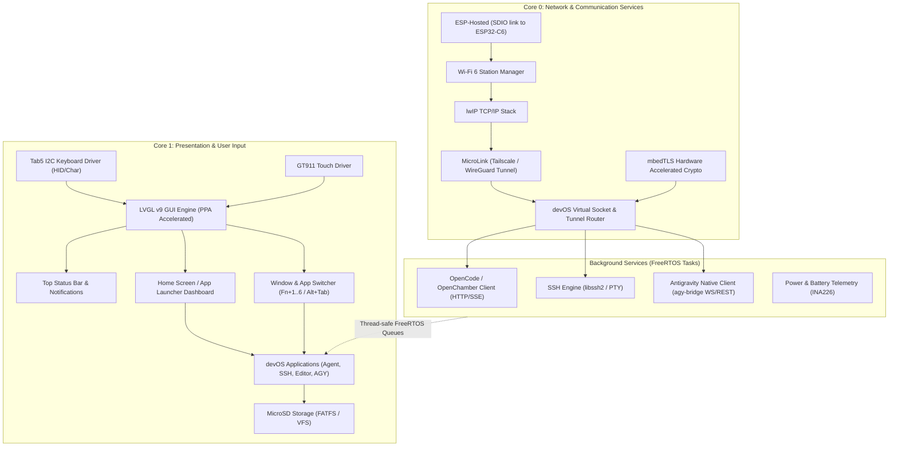
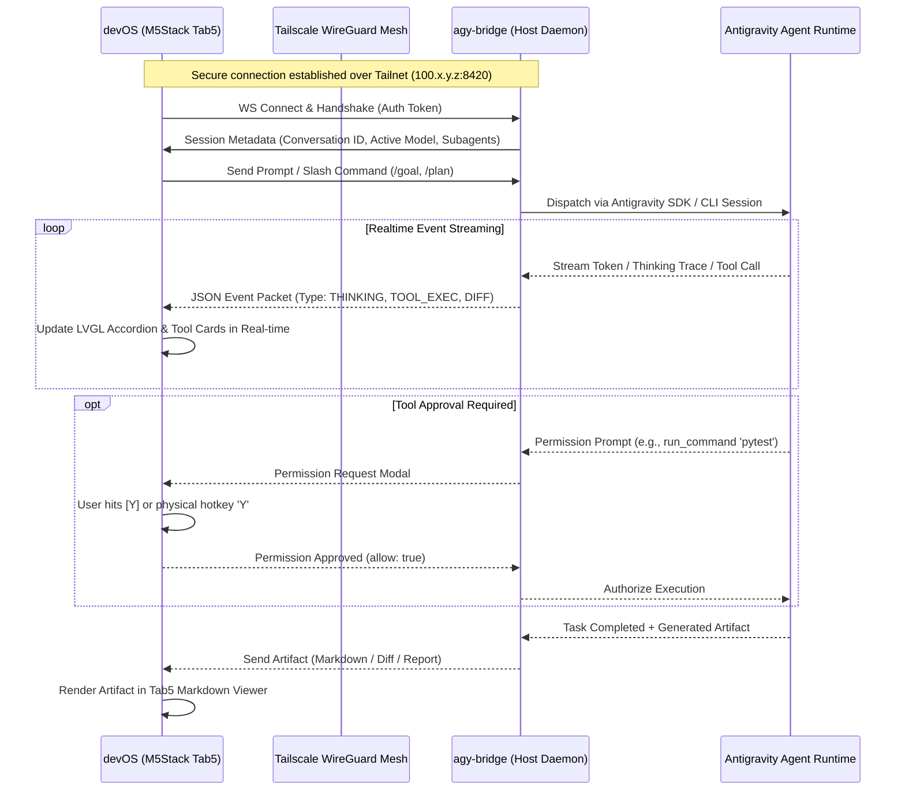

# devOS for M5Stack Tab5: Architecture & Implementation Plan

`devOS` is an open-source, developer-focused mobile operating system and firmware for the **M5Stack Tab5** equipped with the **A164 70-Key Physical Keyboard**. It transforms the Tab5 into a standalone, pocketable cyberdeck tailored for remote AI-assisted software engineering, secure remote systems management, and distraction-free writing.

---

```
  +-----------------------------------------------------------------------------+
  | [devOS]          [WiFi: DevNet -58dBm]        [IP: 10.2.132.54]         94% |
  +-----------------------------------------------------------------------------+
  |                                                                             |
  |   14:28  Wednesday, Sep 20                                                  |
  |   Tailscale: 100.77.11.92 (if connected) | Battery: 7.8V (3.2W, ~4.8h left) |
  |   Memory: 28.4 MB Free PSRAM             | CPU: Core 0: 4% | Core 1: 18%    |
  |                                                                             |
  |  +-------------------+  +-------------------+  +-------------------+        |
  |  | [1] OpenDev       |  | [2] Terminal/SSH  |  | [3] Markdown      |        |
  |  | AI Coding Agents  |  | ANSI PTY Shell    |  | Notes & Docs      |        |
  |  |                   |  |                   |  |                   |        |
  |  | * Status: Idle    |  | * 1 Session (dev) |  | * todo.md         |        |
  |  | * Model: Sonnet   |  | * Host: 100.64.1.2|  | * 14.2 KB        |        |
  |  +-------------------+  +-------------------+  +-------------------+        |
  |                                                                             |
  |  +-------------------+  +-------------------+  +-------------------+        |
  |  | [4] Tailscale     |  | [5] Antigravity   |  | [6] Settings      |        |
  |  | Mesh Network      |  | Native AGY Client |  | System & Config   |        |
  |  |                   |  |                   |  |                   |        |
  |  | * Peers: 6 Online |  | * Bridge: Online  |  | * Wi-Fi / Display |        |
  |  | * DERP: Sydney    |  | * Subagents: 2    |  | * NVS & Storage   |        |
  |  +-------------------+  +-------------------+  +-------------------+        |
  |                                                                             |
  +-----------------------------------------------------------------------------+
  | [Enter/Tap] Launch  |  [1-6] Quick Key  |  [Fn+H] Home  |  [Alt+Tab] Switch |
  +-----------------------------------------------------------------------------+
```

---

## 1. System & Hardware Specifications

### 1.1 Hardware Specifications (M5Stack Tab5 + Keyboard)

| Subsystem | Component | Specifications & Interfaces |
| :--- | :--- | :--- |
| **Main SoC** | Espressif ESP32-P4 | Dual-core RISC-V @ 400 MHz, LP RISC-V @ 40 MHz, 32 MB PSRAM, 16 MB SPI Flash, Hardware 2D PPA (Pixel Processing Accelerator) |
| **Wireless Co-SoC** | Espressif ESP32-C6-MINI-1U | Wi-Fi 6 (2.4 GHz, 802.11ax), Bluetooth 5.2 (LE), Zigbee/Thread; connected to P4 via SDIO using **ESP-Hosted** |
| **Display** | 5.0" IPS TFT Panel | 1280 × 720 resolution, MIPI-DSI interface (ST7123 / EK79007 controller), 60 Hz refresh, 24-bit RGB888 |
| **Touchscreen** | Goodix GT911 | 5-point capacitive multi-touch via dedicated I2C bus |
| **Physical Keyboard** | M5Stack Tab5 Keyboard (A164) | 70-key 14×5 matrix, STM32F030C8T6 coprocessor, I2C address `0x6D` on `Ext.Port1` (SDA: GPIO 0, SCL: GPIO 1, INT: GPIO 50), dual WS2812 status RGBs |
| **Secondary Input** | USB-A 2.0 Host | Supports standard external USB HID keyboards and mice |
| **Camera** | SC2356 (2 Megapixel) | MIPI-CSI 2-lane receiver with hardware ISP, SCCB I2C control, MCLK on GPIO 36 |
| **Local Storage** | MicroSD Slot | 4-bit SDMMC / SPI mode, supporting FAT32 / exFAT cards up to 2TB |
| **Power System** | NP-F550 Mount + INA226 | Removable standard NP-F550 Li-ion battery pack, INA226 I2C power/current monitor, USB-C PD charging |
| **Real-Time Clock** | Epson RX8130CE | I2C RTC with coin-cell battery backup for accurate offline timestamps |
| **Audio** | ES8388 + ES7210 | Dual-channel I2S codec, onboard dual-microphone array, 1W internal speaker, 3.5mm audio jack |
| **Sensors** | Bosch BMI270 | 6-axis IMU (accelerometer + gyroscope) for orientation and motion-wake |

---

## 2. Firmware Software Stack & Architecture

`devOS` is built on top of **ESP-IDF v5.4+** to leverage native ESP32-P4 support, MIPI-DSI hardware acceleration, and the latest lwIP/FreeRTOS enhancements.



### 2.1 Component Selection Matrix

| Subsystem | Primary Selection | License | Alternative / Fallback | Rationale |
| :--- | :--- | :--- | :--- | :--- |
| **OS / RTOS** | ESP-IDF v5.4.x | Apache-2.0 | - | Official Espressif framework with mandatory ESP32-P4 & MIPI-DSI support |
| **GUI Framework** | LVGL v9.2+ | MIT | - | Rich widget set, PPA 2D hardware blitting, monospace terminal & markdown rendering support |
| **Tailscale / VPN** | MicroLink v2 | MIT | `trombik/esp_wireguard` | Full `ts2021` Tailscale protocol stack (DERP relays, STUN, DISCO, MagicDNS, WireGuard ChaCha20-Poly1305) |
| **SSH Client** | `libssh2` (`skuodi/libssh2_esp`) | BSD-3-Clause | `david-cermak/libssh` or `wolfSSH` | Permissive BSD license, supports interactive PTY, password & Ed25519/RSA key auth, proven on ESP32 |
| **HTTP / SSE Client** | Raw BSD-socket HTTP/1.1 + SSE in `opendev_client` over `devos_net` | Apache-2.0 | `esp_http_client` + `esp-tls` | One portable code path for simulator and ESP-IDF/lwIP; non-blocking link, no TLS needed on LAN |
| **WebSocket Client** | `esp_websocket_client` | Apache-2.0 | Custom lwIP WS client | Native IDF support for low-latency bidirectional bridge communication |
| **JSON Parser** | Minimal built-in reader in `opendev_client` (strings, arrays, key lookup) | MIT | `cJSON` / `yyjson` | Only the consumed shapes are parsed; zero new dependencies |
| **Markdown Parser** | Inline CommonMark-subset renderer in `app_editor` (LVGL spangroup-based) | MIT | `md4c` | No extra dependency for the covered subset; host-side unit test in `tools/md_preview_test.c` |
| **Terminal ANSI Engine** | Custom VT100/ANSI parser + LVGL canvas | MIT | Ported `libvterm` | Lightweight, customized for 1280x720 character grid (160x45 columns/rows) |
| **QR Code Scanner** | `quirc` (Pure C99) | BSD-3-Clause | `zxing-cpp` / `esp-zbar` | Ultra-lightweight (15-25ms decode on 400 MHz Core 0), minimal RAM (~76KB QVGA buffer), zero dynamic dependencies |

---

## 3. Core Feature Architecture & Modules

### 3.0 Home Screen & Desktop Environment (`app_launcher`)

The Home Screen serves as the operational dashboard and application launcher for `devOS`.

*   **Visual Layout (1280×720):**
    *   **Top Bar (Persistent across all apps):** Displays devOS logo/home trigger, current Wi-Fi SSID with signal strength (dBm), **Local Network IP (`IP: 10.x.y.z` or `192.168.x.y`, always shown whether Tailscale is connected or not) alongside an authentic Tailscale 3×3 dot matrix icon displayed next to the IP if Tailscale is connected**, battery percentage, and RTC clock. (Theme control lives in Settings + `Fn + T`; the top bar carries no theme button.)
    *   **Telemetry Strip:** Shows real-time battery voltage, power consumption (Watts), estimated remaining battery runtime from the INA226, **Tailscale IP (shown in the info panel *if and only if* Tailscale is active and connected)**, free PSRAM/SRAM, and per-core CPU load. When Tailscale is disconnected, no Tailscale IP or status appears in the info panel.
    *   **Interactive App Grid (2×3 Cards):**
        1.  `[1] OpenDev`: AI coding agent terminal (shows active session title and agent status; connects directly over LAN or optional mesh).
        2.  `[2] Terminal/SSH`: Multi-session PTY terminal (shows open sessions and favorite hosts; connects directly to any LAN IP, hostname, or Tailscale peer).
        3.  `[3] Markdown`: Notes & documentation editor (shows recently edited files).
        4.  `[4] Tailscale`: Optional mesh network manager (shows peer count, DERP latency, ping diagnostics).
        5.  `[5] Antigravity`: Native AGY agent client (shows bridge connection state and active subagent count; connects directly over LAN or optional mesh).
        6.  `[6] Settings`: Wi-Fi provisioning, display brightness, battery stats, storage info.
*   **Navigation & Ergonomics:**
    *   **Direct Key Launch:** Pressing keys `1` through `6` on the A164 keyboard immediately launches that app.
    *   **Arrow Key Navigation:** Highlight cards with arrow keys and press `Enter` to open.
    *   **Global Return:** Pressing `Fn + H`, `Esc`, or tapping the top-left `[devOS]` logo from within any application returns to the Home Screen.
    *   **Multitasking:** Background tasks (SSH sessions, streaming agent tokens, Tailscale tunnels) continue running when returning to the Home Screen.
*   **Tile & Widget Re-arrangement Mode:**
    *   **Interactive Customization:** Users can re-order and customize the 2×3 launcher grid to place their most-used tools into preferred slots.
    *   **Activation & Toggle:** Tapped via the `[⇋ Arrange]` button in the header or via keyboard shortcut `Fn + E` (or pressing `E` while on the Home Screen).
    *   **Touch / Click Reordering:** Tap any tile to select it (highlighted with an amber `#FFB300` border), then tap the destination tile to immediately swap their positions.
    *   **Keyboard Reordering:** Pressing `1` through `6` selects a source slot; pressing a second slot key (`1`–`6`) executes the swap.
    *   **Reset & Exit:** Press `R` or tap `[↺ Defaults]` to revert to the factory layout. Press `Esc` or tap `[✓ Done]` to finalize.
    *   **MicroSD Layout Persistence:** Slot mappings are automatically saved as JSON in `/sdcard/.devos/launcher_layout.json` (and `./sim_sdcard/.devos/launcher_layout.json` in simulation) and loaded at boot.

---

### 3.1 Subsystem 1: Optional Mesh Networking via Tailscale (`net_tailscale`)

The Tailscale client connects the Tab5 to an optional private tailnet (`100.x.y.z`), allowing secure access to remote dev machines, cloud instances, and home servers across the internet without public IP addresses or port forwarding. **devOS is completely independent of Tailscale:** if a user does not want or need Tailscale, all core capabilities (SSH shells, OpenCode, OpenChamber, Antigravity bridge) operate directly over standard local Wi-Fi and LAN IP / DNS routing.

*   **Engine:** `MicroLink` (Tailscale client for ESP-IDF).
*   **Virtual Socket Integration:**
    *   *Challenge:* MicroLink traditionally exposes its own socket interface (`microlink_tcp_connect`) rather than binding automatically to lwIP global default routes.
    *   *Architecture:* devOS implements a **Transparent Socket Transport Layer**:
        *   Standard DNS lookups check for `.ts.net` or `100.x.y.z` addresses.
        *   Tailnet traffic routes through the MicroLink WireGuard tunnel when active.
        *   Standard local LAN and internet traffic routes directly through the default Wi-Fi gateway.
*   **Enrollment & Provisioning:**
    *   Onboarding via Ephemeral or Pre-authenticated Auth Keys (`tskey-auth-...`).
    *   Settings UI displays assigned Tailnet IP, connected DERP relay, peer latency, and active node list.
    *   NVS encrypted storage for the persistent node private key, avoiding re-authentication on reboot.
    *   Can be toggled Disconnected at any time; top bar and homescreen dynamically remove all Tailscale telemetry when disconnected.

---

### 3.2 Subsystem 2: Remote OpenCode & OpenChamber Support (`app_opendev`)

`app_opendev` acts as a handheld AI-assisted coding terminal, connecting to self-hosted instances of **OpenCode** and/or **OpenChamber**.

*   **Dual Protocol Support (as built in `components/opendev_client/`):**
    1.  **Direct OpenCode Server Mode (`opencode serve --port 4096`):**
        *   Raw BSD-socket HTTP/1.1 + SSE over the `devos_net` virtual transport (same code on simulator and ESP-IDF/lwIP; non-blocking SSE link with backoff, short-timeout REST from UI actions).
        *   Endpoints: `GET /session` (list), `POST /session` (create), `GET /session/:id/message?limit=50` (history rebuild), `POST /session/:id/prompt_async` (send), `GET /event` (SSE), `POST /session/:id/abort`, `POST /session/:id/permissions/:pid` (`{response: once|always|reject}`), `GET /session/:id/diff` (rendered raw).
        *   SSE events consumed: `server.connected`, `session.created/status/idle`, `message.updated`, `message.part.updated` (debounced history refetch), `permission.asked`. Minimal built-in JSON reader (no cJSON dependency); unknown events/fields ignored.
        *   Unit test in `tools/opendev_test.c` (isolated CWD required — pairing tests persist sim config).
    2.  **OpenChamber Server Mode:**
        *   Pairing via `openchamber://connect?host=H&port=P&token=T` (`p=` accepted; also the `?v=2&p=` shape), pasteable directly into the in-app Server modal.
        *   Bearer token persisted (encrypted NVS on target, JSON file in sim).
*   **UI (as built in `app_opendev` on the shared viewport):**
    *   Left: server status card (tap = Server modal for host/port/pairing), Link/refresh, + New session, live session list with busy badges.
    *   Center: chat stream (user bubbles, in-place chronological thinking accordions, tool cards, auto-scroll), prompt bar with responsive flex expansion, active note injection button (`[Note]` / `Fn+N`), and `[Send]` button (`Enter` sends, `Ctrl+C` aborts).
    *   Right: session inspector (ID/model/state), action row (`[Diff]`, `[Save Diff]`, `[Save Plan]`), color-coded unified diff viewer (green `+`, red `-`, cyan `@@`, muted headers), and automated MicroSD exports to `/sdcard/plans/` and `/sdcard/diffs/`.
    *   Permission modal `[Y] Once / [N] Deny / [A] Always` via touch or keys (Deny-on-Esc; answers never trap the UI on transport failure).
*   **Tri-Pane Flexible Layout & Focus Mode (1280×720):**
    *   **Left Panel (Collapsible, 260px):**
        *   Project selector and active session list with live status badges.
        *   Session Goals progress tracker and active model picker (`Claude 3.7 Sonnet`, `Gemini 2.5 Pro`, `GPT-4o`, etc.).
        *   *Shortcut:* `Fn + [` (or `Ctrl + B`) to toggle.
    *   **Center Main Canvas (Dynamic Responsive Width: 720px / 980px / 1280px):**
        *   User prompt bubble (styled container with syntax formatting).
        *   Thinking/Reasoning block (collapsible accordion with elapsed time counter, rendered chronologically within turn).
        *   Tool execution cards (showing command run, exit code, file path).
        *   Streaming response text with smooth auto-scroll.
        *   Bottom prompt input bar with physical keyboard input support, active note attachment (`Fn + N`), and responsive flex growth.
    *   **Right Panel (Collapsible, 300px):**
        *   **Files Modified List:** Summary of touched files in the active session.
        *   **Interactive Diff Viewer:** Color-coded unified diffs (green additions, red deletions, cyan hunks) with monospace font styling.
        *   **Session Plan / Task Checklist:** Live checklist of agent sub-tasks, with one-tap export to `/sdcard/plans/<session>.md` and `/sdcard/diffs/<session>.diff`.
        *   *Shortcut:* `Fn + ]` to toggle.
    *   **"Focus Mode" (`Fn + F`):**
        *   Instantly collapses both left and right panels with a single keystroke (or tapping the top `[Focus]` button).
        *   Center chat canvas expands to the **full 1280px display width** for distraction-free reading, long reasoning inspection, and typing.
        *   Pressing `Fn + F` again immediately restores previous sidebar states.
    *   **Interactive Permission Prompts:**
        *   Modal dialog interrupts when an agent asks to execute a command or modify sensitive files: `[Approve (Y)]`, `[Deny (N)]`, `[Always Allow in Session (A)]`. Can be answered with physical keyboard shortcuts.
*   **3.2.1 Camera-Based Zero-Touch Pairing (OpenChamber QR Scanner):**
    *   **Camera Pipeline:** Uses Tab5's onboard **SC2356 2MP camera** via the ESP32-P4 hardware **MIPI-CSI 2-lane receiver** and ISP downscaled to **QVGA (320×240) grayscale**.
    *   **Core Pinning & Performance:** Camera frame acquisition and QR decoding are pinned to **Core 0** using `quirc`, running at 15–25ms per frame (~25 FPS) without dropping frames on Core 1's 60 FPS LVGL presentation loop.
    *   **Power Gating:** The SC2356 camera and MIPI-CSI clock (MCLK GPIO 36) are powered down by default. They are energized exclusively when the scanner modal is invoked and shut off immediately upon barcode capture or cancellation.
    *   **Interactive Viewfinder:**
        *   In OpenDev's Server modal, tapping `[📷 Scan QR]` displays a live camera viewfinder overlay with targeting crosshairs.
        *   Instantly detects `openchamber://connect?host=...&port=...&token=...` QR codes from the OpenChamber web dashboard.
        *   Decoded URI triggers `opendev_client_pair()` automatically, dismisses the viewfinder, and starts SSE streaming with zero manual typing on the physical keyboard.
    *   **Host Simulator Mode:** Provides a clean simulated capture fallback (mock QR injection / image file feed) so desktop and web simulation workflows remain fully testable without physical camera hardware.

---

### 3.3 Subsystem 3: SSH Client & Terminal Emulator (`app_terminal`)

`app_terminal` provides an interactive multi-session shell to any tailnet or LAN server, turning the Tab5 into a portable system administration and coding cyberdeck.

*   **SSH Engine:** `libssh2` with mbedTLS hardware backend.
*   **Collapsible Connections & Sessions Side Panel (260px):**
    *   **Active Sessions Tab:**
        *   Lists all open, concurrent remote shells (e.g., `1: workstation (bash)`, `2: prod-vps (htop)`, `3: home-nas (tail)`).
        *   Visual badge indicates which session is currently attached to the display.
        *   Quick session switching via physical shortcuts (`Alt + 1` .. `Alt + 9`) or touch selection.
        *   `[+] New Session` quick button to spawn an additional concurrent shell.
    *   **Saved Connections Tab (Bookmarks):**
        *   Organized list of saved connection profiles stored in `/sdcard/.ssh/bookmarks.json` or encrypted NVS.
        *   Profile fields: Alias (e.g., "Workstation", "Dev Cluster"), Host/IP (Tailscale FQDN or `100.x.y.z`), Port (default 22), Username, and Auth method (Password or Key: `id_ed25519`).
        *   One-click / one-key instant connect.
        *   Supports importing standard SSH config from `/sdcard/.ssh/config`.
    *   **Side Panel Controls:**
        *   Toggle shortcut: **`Fn + [`** (or `Ctrl + B`), matching the left panel toggle across OpenDev and Antigravity.
        *   Touch toggle: Left margin chevron handle and top header `[Sessions]` icon.
*   **Dynamic PTY Resizing on Panel Toggle:**
    *   *Side Panel Collapsed (Fullscreen Terminal):* Canvas occupies full 1280px width, rendering **160 columns × 45 lines** (with 8×16 font).
    *   *Side Panel Open:* Canvas occupies 1020px width, rendering **128 columns × 45 lines**.
    *   *Real-time SIGWINCH:* Whenever the side panel is toggled open or closed, `libssh2_channel_request_pty_size` immediately broadcasts window size changes (`TIOCSWINSZ`) to the remote host. Remote CLI applications (`htop`, `vim`, `tmux`, `agy`) seamlessly re-layout their interfaces instantly with zero distortion.
*   **Terminal Specifications & Features:**
    *   Full ANSI/VT100 escape code support: 16-color palette (adapting to Dark/Light OS theme), bold, underline, reverse video, and cursor addressing.
    *   Authentication: Password and public-key (Ed25519 & RSA) from `/sdcard/.ssh/` or encrypted NVS.
    *   Host key verification: Trust-On-First-Use (TOFU) with interactive prompt, persistent `known_hosts` storage.
    *   Circular scrollback buffer in PSRAM (configurable up to 10,000 lines).
    *   Touch gestures: swipe up/down for scrollback, pinch to zoom font size.
    *   Local Port Forwarding (`-L`) in background for forwarding remote web services to Tab5 local diagnostic tools.

---

### 3.4 Subsystem 4: Distraction-Free Markdown Editor & Storage (`app_editor`)

`app_editor` is a full-featured markdown notes and documentation workstation that functions both completely offline and in sync with remote workflows.

*   **Automatic MicroSD Detection & Directory Scaffolding (`devos_storage`):**
    *   **Automated Mount Lifecycle:**
        *   Supports 4-bit SDMMC / SPI mode on the ESP32-P4.
        *   Detects card presence at boot or dynamically upon hotplug.
        *   Mounts FAT32/exFAT filesystem cleanly at `/sdcard` via ESP-IDF VFS FATFS.
    *   **Zero-Manual-Setup Scaffolding (`devos_storage_bootstrap()`):**
        *   Upon mounting any compatible card, the firmware automatically checks for and idempotently creates the required system directory tree:
            ```
            /sdcard/
            ├── .ssh/                  # SSH private/public keys, known_hosts, and bookmarks
            │   ├── bookmarks.json     # Saved connection profiles
            │   └── known_hosts        # Persistent SSH host key cache (TOFU)
            ├── notes/                 # User personal and technical Markdown documents
            │   └── welcome.md         # Auto-generated interactive devOS cheat-sheet
            ├── plans/                 # Exported AI Agent plans & implementation specs
            ├── diffs/                 # Exported session diffs & patch files
            └── .devos/                # OS-level metadata, backups, and crash telemetry
                ├── config.json        # User configuration overrides
                └── logs/              # Ring-buffered boot and crash logs
            ```
    *   **Auto-Populated Starter Templates (Generated if missing):**
        *   `/sdcard/notes/welcome.md`: Interactive getting-started guide detailing global hotkeys (`Fn + T`, `Fn + F`, `Fn + [`, `Fn + ]`), Tailscale enrollment, and agent tips.
        *   `/sdcard/.ssh/bookmarks.json`: Pre-populated starter JSON schema with a sample bookmark so users can immediately add server connections.
        *   `/sdcard/.devos/version.txt`: Writes active firmware version and build timestamp.
    *   **Visual Status:**
        *   Home Screen telemetry and top status bar display live SD card presence, capacity, and remaining free space (e.g. `SD: 29.4 GB Free`).
*   **Editor Features (as built):**
    *   **File Explorer:** Live scan of `/sdcard/notes/*.md` (FATFS on target, `./sim_sdcard` in sim) on init and every show; up to 12 entries, tap/click or `Tab` → `↑/↓` → `Enter` to open (amber = keyboard cursor, cyan = open file).
    *   **Multiline Editor:** Physical typing, arrows, backspace, Enter; `Ctrl+S` (save, `[*]` dirty flag), `Ctrl+O` (jump to file list), `Ctrl+N` (new `untitled-N.md`), `Tab` (focus list/editor), `Fn + [` (collapse file tree = fullscreen editing). Save/create failures report transient `SAVE FAILED`-style status (e.g. missing SD).
    *   **View Modes:** `Ctrl+P` cycles Edit → Split → Preview; split preview re-renders on a 400 ms debounce while typing.
    *   **Markdown Renderer (spangroup-based blocks):** H1–H6 (distinct size/color ladder), fenced code (single padded Unscii-16 mono block), GFM tables with/without outer pipes (`+---+` grid, header separator, `:--`/`:--:`/`--:` alignment, shrink-to-fit), `---`/`***`/`___` rules, blockquotes, ul/ol (renumbered)/task lists, paragraphs.
    *   **Inline:** `**bold**` (underline — only a regular font exists), `*italic*` (secondary color), `~~strike~~` (decor), `` `code` ``, `[t](u)` (URL kept visible; balanced parens, `<dest>`, titles), ``, `<autolink>`, backslash escapes, `*`/`_` flanking rules.
    *   **Limits (documented in code):** 16 KB/file, setext headings, reference links, nested-bracket links, indented code blocks, bare-URL linking, `\|` table escapes, CJK column widths, no `Ctrl+F` find.
*   **Agent Synergy:**
    *   **"Attach Note to OpenDev / Antigravity"**: Send the currently open markdown file directly into an active agent session as context (via action bar `[Attach]` button, `Fn + A`, `Ctrl + U`, or `[Note]` pull button in OpenDev).
    *   **"Export Agent Plan & Diffs"**: Save an agent's plan or code explanation directly to `/sdcard/plans/<session>.md` and unified diffs to `/sdcard/diffs/<session>.diff` via right-panel action buttons. Export helpers include filename sanitization (`app_editor_save_plan`, `app_editor_save_diff`).

---

### 3.5 Confirmed Primary Architecture: Antigravity Client (`app_antigravity` via Path B)

> [!IMPORTANT]
> **Architecture Decision Confirmed: Path B (Native GUI Agent Client via `agy-bridge` Sidecar Protocol)** is the designated primary implementation for Google Antigravity support in `devOS`.

Rather than merely running `agy` inside an SSH terminal session, `devOS` provides a **first-class native GUI client** that brings the visual fidelity of the Antigravity desktop environment directly to the Tab5 handheld screen.



#### 3.5.1 Host Sidecar Daemon (`tools/agy_bridge/`)
*   **Language & Stack:** Lightweight Python daemon (using `FastAPI` / `websockets` or Python asyncio) running as a systemd user service (`systemctl --user start agy-bridge`) on the developer's workstation or remote server.
*   **Integration with Antigravity:**
    *   Utilizes the Antigravity SDK (`antigravity-sdk-python`) and monitors the active session transcript logs located at `~/.gemini/antigravity-cli/brain/<conversation-id>/.system_generated/logs/transcript.jsonl`.
    *   Handles bidirectional communication: dispatches user prompts, slash commands (`/goal`, `/plan`, `/schedule`), and manages tool approvals.
*   **Security & Networking:**
    *   Listens exclusively on the host's Tailscale IP interface (`100.x.y.z:8420`).
    *   Authenticated via a shared pre-shared secret (PSK) or token stored in the Tab5's encrypted NVS.

#### 3.5.2 Tab5 Native Client UI (`app_antigravity`)
*   **Tri-Pane Flexible Layout & Focus Mode (1280×720):**
    *   **Left Navigation Pane (Collapsible, 260px):**
        *   Active Conversation details and current AI model selector.
        *   **Subagent Hierarchy Tree:** Displays invoked subagents (e.g. `research`, `self`) with live execution state badges (`running`, `idle`, `waiting_for_input`).
        *   *Shortcut:* `Fn + [` (or `Ctrl + B`) to toggle.
    *   **Center Main Chat Canvas (Dynamic Responsive Width: 720px / 980px / 1280px):**
        *   User messages and Assistant responses rendered with styled Markdown typography.
        *   **Collapsible Thinking Block:** Live accordion showing the agent's internal reasoning/thinking steps with elapsed timer.
        *   **Tool Execution Cards:** Displays invoked tools (e.g., `run_command`, `replace_file_content`, `view_file`) with expandable inputs and outputs.
        *   Bottom action bar with full-width prompt input field and quick slash commands (`/goal`, `/plan`, `/boost`, `/learn`).
    *   **Right Auxiliary Inspector (Collapsible, 300px):**
        *   **Artifacts Tab:** Direct preview of generated code files, architectural plans, and diagrams with markdown rendering.
        *   **File Changes Tab:** Unified diff summary of all files modified in the active session.
        *   *Shortcut:* `Fn + ]` (or `Ctrl + Shift + B`) to toggle.
    *   **"Focus Mode" (`Fn + F`):**
        *   Instantly collapses both left and right panels with a single keystroke (or tapping the top `[Focus]` button).
        *   Center chat canvas expands to the **full 1280px display width** for pure conversational immersion and code reading.
        *   Pressing `Fn + F` again instantly restores previous panel states.
    *   **Permission & Question Modals:**
        *   Interactive popups when an agent requests tool authorization or asks multiple-choice clarification questions. Accessible via touchscreen or instant physical keyboard shortcuts (`Y` for approve, `N` for deny, `1`..`4` for multiple-choice options).

---

### 3.6 Unified Agent UI Framework & "Focus Mode" Mechanics

Both `app_opendev` and `app_antigravity` are built on a shared, highly responsive container component in `devos_ui` (`devos_agent_viewport`). This guarantees a consistent muscle memory and interaction model across both agent environments.

```
State 1: Tri-Pane (Full Context Mode)
+---------------+---------------------------------------+---------------+
| Left Panel    | Center Chat & Reasoning Stream        | Right Panel   |
| (260px)       | (720px)                               | (300px)       |
| Projects /    | > User Prompt                         | Files / Diffs |
| Subagents     | > Agent Thinking / Tool Executions    | Artifacts /   |
| Models        | > Assistant Markdown Response         | Plan Tasks    |
+---------------+---------------------------------------+---------------+

State 2: Focus Mode (Full-Width Chat Mode - Fn + F)
+-----------------------------------------------------------------------+
| Center Chat & Reasoning Stream (Full 1280px Viewport)                 |
|                                                                       |
| > User Prompt                                                         |
| > Agent Thinking [Collapsible Accordion]                              |
| > Tool Execution Cards                                                |
| > Assistant Markdown Response Stream                                  |
|                                                                       |
+-----------------------------------------------------------------------+
| > Prompt Input Bar                                                    |
+-----------------------------------------------------------------------+
```

*   **Four Responsive Layout States:**
    1.  **Tri-Pane (Both Open):** Left 260px | Center 720px | Right 300px.
    2.  **Left-Only (Right Collapsed):** Left 260px | Center 1020px.
    3.  **Right-Only (Left Collapsed):** Center 980px | Right 300px.
    4.  **Focus Mode (Both Collapsed):** Center expands to **full 1280px**.
*   **Hardware & Touch Controls:**
    *   **`Fn + F`**: Toggle Focus Mode on/off. Restores previous panel configuration when toggled off.
    *   **`Fn + [` (or `Ctrl + B`)**: Toggle Left Sidebar independently (supported across OpenDev, Antigravity, and Terminal).
    *   **`Fn + ]` (or `Ctrl + Shift + B`)**: Toggle Right Inspector independently (supported across OpenDev and Antigravity).
    *   **Touch Handles**: Subtle chevron toggle handles on the top left and top right of the viewport, plus a dedicated `[Focus]` header icon.

---

### 3.7 Global Theme Engine: Dark & Light Modes (`devos_theme`)

`devOS` incorporates a system-wide theme manager in `components/devos_ui/devos_theme.h` that instantly switches the entire operating system between **Dark Cyberdeck** mode and **High-Contrast Light** mode.

*   **Dual Color Palettes:**
    *   **Dark Cyberdeck Theme (Default):**
        *   Backgrounds: Deep slate/obsidian (`#121417`, `#1A1D24`).
        *   Surfaces & Cards: Charcoal gray (`#242933`) with subtle borders (`#3B4252`).
        *   Accents: Neon cyan (`#00E5FF`) and emerald green (`#00E676`).
        *   Text: Bright white (`#ECEFF4`) and silver muted text (`#D8DEE9`).
        *   Use Case: Optimized for indoor development, night sessions, and battery power conservation.
    *   **High-Contrast Light Theme:**
        *   Backgrounds: Clean daylight paper white (`#F8FAFC`, `#FFFFFF`).
        *   Surfaces & Cards: Pure white cards with crisp slate borders (`#E2E8F0`).
        *   Accents: Deep cobalt blue (`#2563EB`) and sharp teal (`#0D9488`).
        *   Text: High-density dark ink (`#0F172A`) and deep charcoal secondary text (`#334155`).
        *   Use Case: **Essential for direct sunlight and outdoor visibility** on the Tab5's 5.0" IPS display.
*   **System-Wide Scope & Propagation:**
    *   **Top Bar & Home Screen:** Real-time re-skinning of the status bar, telemetry charts, and live app tiles.
    *   **OpenDev & Antigravity:** Switches chat bubble backgrounds, collapsible thinking accordions, tool logs, and syntax highlighting color schemes (Dark syntax vs Light Solarized / GitHub light syntax).
    *   **Terminal Emulator:** Maps the 16-color ANSI palette dynamically:
        *   *Dark Mode:* Deep black background (`#0C0E14`) with bright, saturated ANSI colors.
        *   *Light Mode:* High-contrast light paper background (`#F8FAFC`) with dark, high-contrast ANSI colors (preventing washed-out yellow/cyan text on light backgrounds).
    *   **Markdown Editor:** Editor canvas switches from Dark Editor (monokai/charcoal) to Clean Paper (black text on crisp white with light code block backgrounds).
    *   **Keyboard RGB Backlight:** Tab5 A164 keyboard status LEDs sync with theme (e.g., cyan/amber ambient in Dark mode, crisp neutral daylight white in Light mode).
*   **Toggle Controls:**
    *   **Global Hotkey:** **`Fn + T`** instantly flips between Dark and Light mode from anywhere in the OS without restarting or losing UI state.
    *   **Settings App:** Moon / switch / sun control (`knob left = Dark, right = Light`); stays in sync with `Fn + T`.
    *   **Boot Default:** Dark Cyberdeck. (NVS persistence of the theme preference is not yet implemented.)

---

## 4. Hardware Integration: Keyboard, Display, & Power

### 4.1 Tab5 Keyboard Driver (A164)

The Tab5 physical keyboard is a critical input surface for `devOS`.

*   **Hardware Interconnect:**
    *   Controller: STM32F030C8T6.
    *   Bus: Dedicated I2C bus on Ext.Port1 (SDA: GPIO 0, SCL: GPIO 1, INT: GPIO 50).
    *   Default I2C Address: `0x6D`.
*   **Operating Modes:**
    *   *Normal Mode:* Emits raw 14×5 matrix state.
    *   *HID Mode:* Emits standard USB HID keyboard reports (modifier byte + 6 keycodes).
    *   *Character Mode:* Emits ASCII character strings along with modifier states.
*   **Implementation Strategy:**
    *   Use **HID Mode** for the core OS input layer. HID mode provides unambiguous key-down and key-up events for modifier keys (`Ctrl`, `Alt`, `Shift`, `Fn`).
    *   A dedicated FreeRTOS keyboard task waits on GPIO 50 interrupt transitions, reads reports via I2C, and pushes structured `key_event_t` structs into an LVGL input driver queue.
*   **Global Hotkeys:**
    *   `1` .. `6` (from Home Screen): Instant app launch.
    *   `Fn + H`: Global Home Screen return from any application.
    *   `Fn + 1` .. `Fn + 6`: Instant switch between Apps from anywhere.
    *   `Fn + T`: **Toggle Dark / Light Theme** system-wide.
    *   `Fn + F`: **Toggle Focus Mode** (collapses/restores sidebars in OpenDev & Antigravity).
    *   `Fn + [` (or `Ctrl + B`): Toggle Left Sidebar (Sessions / Bookmarks / Subagents in OpenDev, AGY, and Terminal).
    *   `Fn + ]` (or `Ctrl + Shift + B`): Toggle Right Inspector (Files / Diffs / Artifacts in OpenDev & AGY).
    *   `Alt + 1` .. `Alt + 9`: Instant switch between active concurrent SSH sessions in Terminal.
    *   `Ctrl + Tab` / `Alt + Tab`: Cycle recent apps.
    *   `Fn + Space`: Global quick-launcher / command palette.
    *   `Fn + Up/Down`: Screen brightness adjustment.
    *   `Fn + B`: Toggle keyboard RGB backlight mode / power.

### 4.2 Display & Graphics Pipeline

*   **Panel:** 5.0" 1280×720 IPS TFT over MIPI-DSI.
*   **Memory Management:**
    *   ESP32-P4 does not have dedicated on-chip VRAM; drawing must take place in PSRAM.
    *   LVGL configured with **two partial line buffers in PSRAM** (e.g., 2× 1280×120 lines, ~600 KB each) to avoid wasting 1.8 MB on full-frame buffers while ensuring smooth 45-60 FPS refresh.
    *   Enable ESP32-P4 hardware **PPA (Pixel Processing Accelerator)** for hardware-accelerated color format conversion and blitting.

### 4.3 Power Management & Battery Telemetry

*   **Power Monitor:** INA226 monitoring battery voltage, current draw, and charging status.
*   **Power Modes:**
    *   *Active:* Both cores running @ 400 MHz, display on, Wi-Fi connected (~1.5W - 2.2W).
    *   *Dimmed / Idle:* Cores dynamically throttle to 160 MHz after 2 minutes of inactivity, screen dimmed.
    *   *Deep Sleep / Standby:* After 10 minutes of inactivity (or via power button press), screen and backlight turned off, C6 placed into low-power wake mode, P4 enters light sleep. Wake up instantly via BMI270 motion detection, power button, or physical keyboard keypress.

---

### 4.4 Remote Web UI Simulator & Live Verification (noVNC over LAN / Tailscale)

To enable the developer to test and evaluate UI/UX progress remotely from their local macOS laptop without flashing the Tab5 hardware:

```
[ Headless Linux Dev Server ]                  [ Local macOS Laptop ]
 devos_sim (LVGL @ 1280x720)                    Safari / Chrome Browser
       │                                                   ▲
       ▼                                                   │ (Mouse = Touch)
  Xvfb (Virtual Screen) ──► noVNC Web Stream (Port 6080) ──┘ (Keys = A164)
                   [ LAN IP: 10.2.132.54:6080 | Tailscale: 100.77.11.92:6080 ]
```

*   **Headless Simulator Architecture (`tools/sim/`):**
    *   **Virtual Screen (`Xvfb`):** Spawns a 1280×720×24 virtual X11 framebuffer (`:99`) matching the Tab5's native pixel geometry.
    *   **VNC Engine (`x11vnc`):** Captures the virtual display buffer at 60 FPS without graphical degradation.
    *   **WebSocket Bridge (`noVNC` / `websockify`):** Streams the display buffer as an interactive HTML5 canvas over port `6080`.
    *   **Direct Developer URLs:** `http://10.2.132.54:6080/vnc.html` (direct LAN) or `http://100.77.11.92:6080/vnc.html` (Tailscale).
*   **Emulated Inputs:**
    *   *Mouse clicks & drags* map directly to GT911 capacitive touch events (tap, swipe, scroll).
    *   *PC/Mac keyboard inputs* map directly to Tab5 A164 physical keyboard scan codes, allowing real-time testing of hotkeys (`Fn + T` for Theme, `Fn + F` for Focus Mode, `Fn + [` / `Fn + ]` for Sidebars, and `1`..`6` for App launcher).
*   **One-Command Runner Script (`tools/sim/run_web_sim.sh`):**
    *   Automatically handles building the desktop simulator target with CMake/Ninja, launching or restarting the Xvfb/noVNC background service, and binding to port `6080`.

---

## 5. Implementation Roadmap

### Phase 0: Foundation & Hardware Validation (Spike)
- [x] Configure ESP-IDF v5.4.x development environment for target `esp32p4`.
- [x] Set up **Remote Web UI Simulator (`tools/sim/run_web_sim.sh`)** with SDL2, Xvfb, and noVNC on port 6080.
- [x] Flash ESP-Hosted slave firmware onto the ESP32-C6 coprocessor (`tools/flash_c6_slave.sh`).
- [x] Verify Tab5 BSP: bring up 1280×720 MIPI-DSI display with LVGL v9 demo and GT911 touch.
- [x] Implement Ext.Port1 I2C driver for Tab5 Keyboard (A164); verify interrupt handling and HID key decoding.
- [x] Mount MicroSD card using 4-bit SDMMC driver and auto-scaffolding bootstrap.

### Phase 1: Core OS Shell, Home Screen, Themes & Window Manager
- [x] Create `devOS` core application framework with FreeRTOS dual-core task segregation (Core 0: network, Core 1: UI).
- [x] Implement **Global Theme Engine (`devos_theme`)** with Dark Cyberdeck and High-Contrast Light palettes, NVS persistence, and hotkey `Fn + T`.
- [x] Build Top Status Bar (Wi-Fi RSSI, Local IP with conditional Tailscale mesh icon, Battery percentage via INA226, RTC Clock; theme control lives in Settings + `Fn + T`).
- [x] Build **Home Screen / App Launcher Dashboard** (`app_launcher`) with 6 live app cards and telemetry.
- [x] Implement **Home Screen Tile/Widget Re-arrangement Mode** (interactive click-to-swap, [1..6] keyboard hotkeys, [↺ Defaults] reset, and JSON persistence to MicroSD storage).
- [x] Implement Window Manager & App Switcher with hotkey navigation (`Fn + 1..6`, `Fn + H`).
- [x] Verify complete Phase 1 UI/UX in remote web simulator (`http://10.2.132.54:6080/vnc.html` or `http://100.77.11.92:6080/vnc.html`).
- [x] Build Settings & Wi-Fi Provisioning App (Captive Portal + On-screen network scanner).

### Phase 2: Optional Tailscale Mesh Networking
- [x] Port/integrate `MicroLink` component into the ESP-IDF project.
- [x] Implement NVS encrypted storage for Tailscale node credentials.
- [x] Implement virtual socket routing layer bridging lwIP TCP connections across the WireGuard tunnel (fallback to direct LAN when inactive).
- [x] Build Tailscale Status UI: connection toggle, node status, peer list, DERP ping diagnostics.
- [x] Connect to live Tailscale network: real-time discovery of live tailnet peers, node IPs, DERP latency, and per-peer ping diagnostics.

### Phase 3: Terminal & Multi-Session SSH Client
- [x] Integrate `libssh2` with mbedTLS hardware cryptography.
- [x] Implement **Collapsible Connections & Sessions Side Panel (260px)** with Active Sessions and Saved Bookmarks tabs (`Fn + [`).
- [x] Implement ANSI/VT100 terminal widget in LVGL (dynamic 160×45 / 128×45 character grid).
- [x] Implement real-time PTY window resizing (`TIOCSWINSZ` / SIGWINCH) on sidebar toggle.
- [x] Map Tab5 physical keyboard to VT100 control sequences (`Ctrl+C`, `Ctrl+D`, `Ctrl+Z`, arrow keys, Esc, Tab, `Alt + 1..9` session switch).
- [x] Add session bookmarking and SSH key management from `/sdcard/.ssh/` (complete CRUD: `[x]` delete button on cards, `[Save Bookmark]` in Quick Connect modal, and `[+ Add Bookmark]` bottom action button with dedicated modal mode).
- [x] Live interactive SSH PTY session engine: real shell execution (`root@...`), concurrent sessions, focus trap, and seamless peer shell launching.

### Phase 4: Markdown Editor
- [x] Implement File Explorer UI with MicroSD directory navigation (live `/sdcard/notes/*.md` scan, keyboard + touch open).
- [x] Build multiline text editor widget with cursor navigation and shortcut handling (`Ctrl+S`, `Ctrl+O`, plus `Ctrl+N`, `Tab`, `Fn + [`).
- [x] Integrate lightweight Markdown renderer (headings, bold/italic/strike/code, links, tables, code blocks, lists, quotes, rules, checklists; see §3.4 for exact coverage).
- [x] Implement split-view and fullscreen editing modes (`Ctrl+P` cycle; 400 ms debounce re-render). Adversarial review fixes merged (pipe-less tables, balanced-paren URLs, UTF-8-safe truncation, save-failure feedback); unit test in `tools/md_preview_test.c`.
- [x] Agent Synergy & Export API: added top-bar `[Attach]` button and hotkeys (`Fn + A`, `Ctrl + U`) to inject active notes directly into AI agent prompt contexts, plus sanitized file exporters to `/sdcard/plans/` and `/sdcard/diffs/`.

### Phase 5: Remote OpenCode & OpenChamber Client
- [x] Build HTTP/SSE client engine for OpenCode REST API (`/session`, `/event`).
- [x] Implement OpenChamber pairing handshake and token authentication.
- [x] Design dual-pane UI: sessions sidebar and scrollable chat stream.
- [x] Implement rich message cards: reasoning/thought accordions, tool logs, diff visualizer.
- [x] Build interactive Permission Request popup system.
- [x] Interactive Diff & Session Export: color-coded unified diff viewer in right inspector, `[Diff]`, `[Save Diff]`, and `[Save Plan]` export triggers.
- [x] Dual-Way Synergy & Input Bar: integrated `[Note]` button in OpenDev input bar (`Fn + N`) to pull active notes; fixed viewport positioning and padding for full visibility across all 4 responsive viewport modes (Tri-Pane, Left-Only, Right-Only, Focus Mode).
- [x] Hardened REST & SSE Engine: fixed HTTP Authorization header concatenation, resolved premature SSE buffer clearing, and implemented fallback parsing for message parts and tool inputs.
- [x] Camera-Based OpenChamber QR Pairing: onboard SC2356 MIPI-CSI camera capture + `quirc` QR decoder on Core 0 with live viewfinder modal in `app_opendev`, pairing token extraction, and simulator mock support.

### Phase 6: Antigravity Native Client (Path B)
- [ ] Design and implement the host-side `agy-bridge` Python daemon in `tools/agy_bridge/`.
- [ ] Implement `esp_websocket_client` transport in devOS connecting to `100.x.y.z:8420`.
- [ ] Build native Antigravity UI canvas (`app_antigravity`):
  - [ ] Subagent hierarchy tree panel.
  - [ ] Collapsible thinking/reasoning accordions.
  - [ ] Interactive tool permission and question modals with keyboard hotkeys.
  - [ ] Artifacts inspector with Markdown viewer integration.
- [ ] Add power management: INA226 battery gauge, screen dimming, and sleep modes.
- [ ] Implement OTA (Over-The-Air) firmware update mechanism.

---

## 6. Directory Structure & Repository Layout

```
tab5-devos/
├── CMakeLists.txt                 # Top-level ESP-IDF CMake configuration
├── sdkconfig.defaults             # Default ESP-IDF configuration (P4, PSRAM, FreeRTOS)
├── partitions.csv                 # Flash partition table (app, ota_0, ota_1, nvs, storage)
├── components/                    # Modular devOS components
│   ├── devos_core/                # App manager, window switcher, event bus
│   ├── devos_ui/                  # LVGL v9 themes, widgets, top bar, home dashboard
│   ├── devos_net/                 # Wi-Fi manager, DNS, lwIP routing, virtual transport
│   ├── bsp_tab5/                  # Tab5 board drivers (MIPI-DSI, GT911, INA226, RTC, SC2356 camera)
│   ├── tab5_keyboard/             # A164 I2C keyboard driver & HID mapper
│   ├── microlink/                 # Tailscale / WireGuard client
│   ├── libssh2_port/              # libssh2 SSH client component
│   ├── opendev_client/            # OpenCode/OpenChamber HTTP+SSE engine
│   └── quirc/                     # Pure-C QR code recognition library
├── main/
│   ├── main.c                     # System boot, hardware init, FreeRTOS task launch
│   ├── apps/
│   │   ├── app_launcher/          # Home Screen dashboard & app switcher
│   │   ├── app_opendev/           # OpenCode / OpenChamber client UI & logic
│   │   ├── app_terminal/          # SSH client & ANSI terminal emulator
│   │   ├── app_editor/            # MicroSD Markdown editor & previewer
│   │   ├── app_tailscale/         # Tailnet status & peer manager UI
│   │   ├── app_antigravity/       # Native Antigravity GUI client (Path B)
│   │   └── app_settings/          # Wi-Fi setup, display, power, system info
│   └── include/
│       └── devos_config.h         # System constants and pin definitions
├── tools/
│   ├── sim/                       # Remote Web Simulator scripts (noVNC on port 6080)
│   │   ├── run_web_sim.sh         # Starts/restarts Xvfb, x11vnc, noVNC, and devos_sim
│   │   └── setup_sim_env.sh       # Installs dnf prerequisites (SDL2, Xvfb, x11vnc, novnc)
│   ├── agy_bridge/                # Host-side Python sidecar daemon for Antigravity
│   │   ├── bridge_server.py       # FastAPI / WebSocket server (port 8420)
│   │   ├── transcript_watcher.py  # Realtime parser for transcript.jsonl
│   │   └── requirements.txt       # Python dependencies
│   ├── flash_c6_slave.sh          # Helper script to flash ESP-Hosted to ESP32-C6
│   ├── md_preview_test.c          # Host-side unit test for the editor Markdown renderer
│   ├── opendev_test.c             # Host-side unit test for the OpenCode engine
│   └── camera_qr_test.c           # Host-side unit test for Tab5 camera & QR decoder
```

---

## 7. Critical Risks & Mitigations

| Risk | Impact | Mitigation Strategy |
| :--- | :--- | :--- |
| **MicroLink lwIP routing** | High: Standard socket calls (`connect()`) may bypass the tailnet tunnel | Wrap outgoing connections in a virtual transport adapter; test raw socket routing through WireGuard tun interface early in Phase 0. |
| **SRAM contention during TLS/SSH/WS** | Medium: TLS handshakes require contiguous internal SRAM buffers | Allocate LVGL display draw buffers strictly in external PSRAM (32 MB available); keep at least 120 KB of internal SRAM reserved for TLS handshakes. |
| **ESP-Hosted C6 Wi-Fi stability** | High: Network drops if SDIO link stalls | Use standard SDIO mode; implement FreeRTOS watchdog on the network task with automatic ESP-Hosted link re-init. |
| **Physical Keyboard Key Rollover / Missed Keys** | Medium: Fast typing might drop characters over I2C | Use interrupt-driven I2C reads with GPIO 50 active-low trigger; set I2C clock frequency to 400 kHz; buffer keycodes in a thread-safe ring buffer. |
| **OpenChamber / AGY API drift** | Medium: Upstream updates could break custom client | Decouple UI from protocol via `agy-bridge` sidecar; fall back to standard transcript watcher or direct SSH if needed. |
